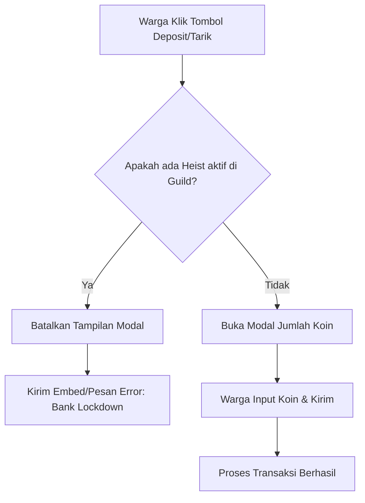

# Product Requirement Document (PRD) - Sistem Lockdown Bank Selama Heist Aktif

## 1. Pendahuluan
Untuk meningkatkan realisme permainan roleplay kriminalitas di server Discord, sistem perbankan harus merespons situasi darurat secara dinamis. Ketika ada operasi perampokan bank (`.heist`) yang sedang berlangsung (baik dalam fase lobi persiapan maupun fase eksekusi QTE), sistem keamanan bank harus masuk ke mode **Lockdown Darurat**. Hal ini memblokir seluruh aktivitas penyimpanan (Deposit) dan penarikan (Withdraw) saldo untuk mensimulasikan penutupan sistem brankas demi keamanan dana nasabah dan mencegah manipulasi saldo selama heist.

---

## 2. Deskripsi Fitur
* **Status Darurat (Lockdown Mode)**: Status ini otomatis aktif jika terdapat objek lobi perampokan aktif dalam memori bot (`robbery.activeHeists.has(guildId)`).
* **Blokir Deposit & Penarikan**: 
  * Semua warga server (tidak terbatas pada peserta heist) tidak dapat melakukan deposit koin ke bank.
  * Semua warga server tidak dapat melakukan penarikan koin dari bank.
  * Blokir berlaku pada dua titik akses:
    1. Menu interaktif perintah `.bank`.
    2. Menu interaktif Portal Permanen (`Portal Hub`).
* **Penyampaian Pesan**: Ketika warga mencoba menekan tombol `Deposit` atau `Tarik Uang`, bot akan membatalkan aksi dan membalas dengan embed bertema **Sistem Keamanan Darurat Aktif**.

---

## 3. Alur Kerja & Logika Sistem



### 3.1. Validasi Keamanan pada Kode
Sebelum bot menampilkan modal masukan (`ModalBuilder`) untuk jumlah deposit atau penarikan, bot melakukan pengecekan:
```javascript
const activeHeist = robbery.activeHeists.get(guildId);
if (activeHeist) {
  // Batalkan aksi dan kirim pesan darurat
}
```

### 3.2. Desain Visual Pesan Lockdown Bank
Pesan kegagalan transaksi selama lockdown akan menggunakan warna **Merah Pekat (Crimson/Danger)** dengan detail visual sebagai berikut:

* **Judul**: `🚨 BANK SECURITY: LOCKDOWN SYSTEM ACTIVE! 🚨`
* **Deskripsi**:
  ```text
  🚫 TRANSAKSI DITOLAK: JARINGAN BANK NONAKTIF 🚫
  
  Jaringan sistem perbankan utama telah dinonaktifkan secara otomatis oleh protokol keamanan karena adanya aktivitas mencurigakan/percobaan perampokan (HEIST) yang sedang berlangsung!
  
  🔓 Status Gerbang Baja: TERTUTUP RAPAT (LOCKDOWN)
  💻 Status Server Bank: OFFLINE DARURAT
  
  *Harap tunggu sampai situasi di area Bank Pusat kembali kondusif sebelum melakukan transaksi simpan-pinjam.*
  ```

---

## 4. Rencana Implementasi

### Berkas yang Akan Dimodifikasi:
1. **[embeds.js](file:///Users/joefany/bot-discord-2026/stockmarket/embeds.js)**:
   * Menambahkan fungsi pembantu `bankLockdownEmbed(guild)` untuk merender kartu visual darurat bank yang rapi dan premium.
2. **[index.js](file:///Users/joefany/bot-discord-2026/stockmarket/index.js)**:
   * Mengintegrasikan validasi status heist aktif pada callback tombol `bank_btn_deposit` (Portal & `.bank` Biasa).
   * Mengintegrasikan validasi status heist aktif pada callback tombol `bank_btn_withdraw` (Portal & `.bank` Biasa).

---

## 5. Rencana Verifikasi

1. **Pengujian Mode Normal**:
   * Memastikan ketika tidak ada heist, perintah `.bank` dan transaksi deposit/tarik berjalan dengan mulus tanpa kendala.
2. **Pengujian Mode Heist Aktif**:
   * Jalankan `.heist` di server untuk membuka lobi.
   * Saat lobi berjalan, ketik `.bank` dan klik tombol **Deposit** atau **Tarik Uang**.
   * Pastikan bot **tidak menampilkan modal input**, melainkan langsung membalas dengan **Embed Lockdown Bank**.
   * Lakukan pengujian yang sama pada menu Portal Permanen.
3. **Pengujian Setelah Heist Selesai**:
   * Tunggu hingga heist selesai (berhasil/gagal/dibatalkan).
   * Ketik `.bank` dan pastikan tombol **Deposit** dan **Tarik Uang** dapat dibuka kembali dengan normal.
