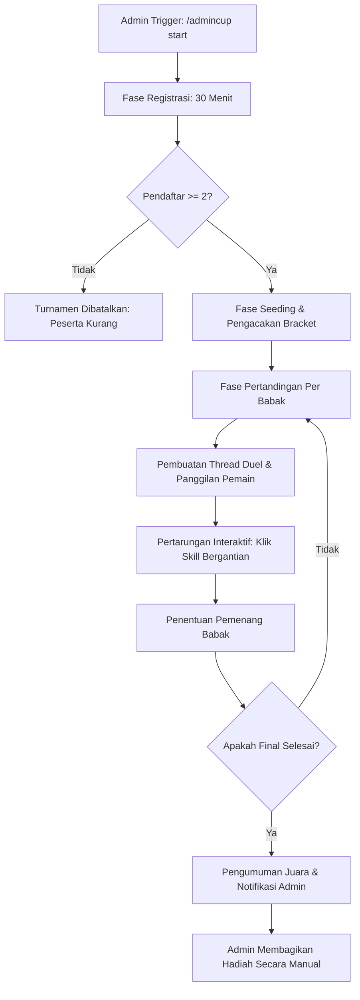

# Product Requirement Document (PRD)
## Fitur: Admin Cup Pet Tournament (Event Turnamen Adu Pet Interaktif)

| Dokumen Info | Detail |
| --- | --- |
| **Status** | Draft (Proposed) |
| **Penulis** | Antigravity AI |
| **Tanggal Pembuatan** | 5 Juni 2026 |
| **Target Rilis** | Sprint 11 (Event PvP Interaktif & Turnamen Otomatis) |
| **Target Platform** | Discord Bot (Sentinel Bot) |

---

## 1. Latar Belakang & Tujuan

Saat ini, fitur pertarungan PvP antar pet di Discord bot bersifat **simulasi otomatis penuh (instant simulation)**, di mana hasil pertarungan dihitung langsung di belakang layar dan log instan langsung ditampilkan. Pemain tidak memiliki kontrol atas jalannya pertempuran selain meningkatkan stat pet mereka di Gym. 

Untuk meningkatkan keterlibatan (*engagement*) komunitas dan memberikan ruang kompetitif yang seru, fitur **Admin Cup Pet Tournament** diperkenalkan. Fitur ini memungkinkan:
- **Event Turnamen yang Dipimpin Admin:** Admin dapat memulai cup turnamen kapan saja untuk memicu persaingan sehat di server.
- **Partisipasi Aktif Pemain:** Pemain tidak hanya mendaftar, tetapi harus **terlibat aktif mengeklik tombol skill** pet secara bergantian (turn-based) saat bertanding.
- **Bracket Otomatis:** Sistem secara otomatis mengacak peserta, menyusun bagan tanding (bracket), membuat arena bertarung (thread khusus), dan menentukan pemenang hingga babak final selesai.
- **Fleksibilitas Hadiah:** Admin memegang kendali penuh untuk membagikan hadiah (misalnya koin server, item khusus, role, atau pet kustom) secara manual kepada sang juara setelah turnamen selesai.

---

## 2. Alur & Fase Turnamen

Turnamen Admin Cup dibagi menjadi beberapa fase terstruktur yang berjalan secara otomatis:



### 2.1 Fase 1: Pemicu Admin (Event Trigger)
- Admin memulai turnamen menggunakan slash command: `/admincup start [durasi_daftar] [channel] [min_level] [max_level]`
  - `durasi_daftar`: Default 30 menit.
  - `channel`: Channel khusus tempat bracket dan pengumuman turnamen diposting.
  - `min_level`: Opsional, batas minimal level pet untuk berpartisipasi (jika tidak diisi, default $\ge$ 10).
  - `max_level`: Opsional, batas maksimal level pet untuk berpartisipasi.
- Hanya pengguna dengan role Administrator atau Owner Bot yang dapat memicu perintah ini.

### 2.2 Fase 2: Pendaftaran Peserta (Registration - 30 Menit)
- Waktu pendaftaran dibatasi selama **30 menit** setelah diumumkan.
- Pemain mendaftarkan pet aktif mereka dengan perintah: `/admincup register` atau `.pet cup register`
- **Syarat Pendaftaran Pet:**
  - Pet harus berstatus Dewasa (`ADULT` / Level $\ge$ 10).
  - Level pet harus berada dalam rentang `min_level` dan `max_level` jika ditentukan oleh Admin.
  - HP Pet minimal **50%** saat mendaftar.
  - Setiap pemain hanya boleh mendaftarkan **1 pet** per turnamen.
- Sistem akan mengirimkan pesan embed pengumuman pendaftaran yang terus diperbarui (live update) menampilkan daftar peserta yang sudah bergabung.
- Bot mengirimkan pengumuman pengingat (countdown) pada menit ke-15, ke-25, dan ke-29.

### 2.3 Fase 3: Pengacakan & Penyusunan Bracket (Seeding)
- Setelah 30 menit berlalu, pendaftaran ditutup secara otomatis.
- Sistem mengacak (*shuffle*) seluruh daftar peserta untuk mencegah manipulasi bagan.
- **Logika Bagan Single-Elimination (Sistem Gugur):**
  - Jika jumlah peserta bukan kelipatan $2^n$ (misal: 5, 7, 9 pemain), sistem secara otomatis memberikan **"Bye"** (lolos langsung ke babak berikutnya tanpa bertanding) kepada beberapa pemain yang dipilih secara acak pada ronde pertama.
  - Bagan turnamen (Bracket Tree) dibuat dalam bentuk teks/emoji yang estetik dan diposting di channel utama turnamen.

### 2.4 Fase 4: Babak Pertandingan (Match Rounds)
- Pertandingan dijalankan babak demi babak (Round of 16, Quarter-Finals, Semi-Finals, Finals).
- **Berurutan (Sequential):** Pertandingan dijalankan secara berurutan satu per satu. Pertandingan berikutnya dalam babak yang sama baru akan dimulai setelah pertandingan sebelumnya selesai, sehingga seluruh anggota server dan pemain lainnya dapat menonton jalannya duel secara live.
- Setiap pertandingan akan mendapatkan **Discord Thread** khusus (misalnya `#cup-match-petA-vs-petB`) yang dibuat di bawah channel turnamen agar jalannya pertarungan terfokus dan tidak mengganggu obrolan utama.
- Bot men-tag kedua pemain di thread tersebut untuk memulai pertarungan.
- Pertarungan menggunakan sistem turn-based interaktif (detail di Bagian 3).
- Setelah pertandingan selesai, bot menutup thread, memperbarui bracket, memberikan jeda istirahat (misal 1 menit), lalu memicu pertandingan berikutnya.

### 2.5 Fase 5: Pengumuman Juara & Hadiah (Winner & Rewards)
- Setelah pertandingan Final selesai, bot mengumumkan sang juara di channel utama turnamen dengan embed perayaan yang megah.
- Bot mengirimkan direct message (DM) atau ping khusus ke Admin pembuat event:
  > **"🏆 Admin Cup telah selesai! Pemenang pertama adalah @UserJuara (Pet: NamaPet). Silakan berikan hadiah secara manual."**
- Pemenang tidak langsung mendapatkan hadiah otomatis dari bot; ini memberikan kebebasan bagi admin untuk memberikan hadiah sesuai dengan tema turnamen (misalnya uang tunai, item langka, atau role kehormatan).

---

## 3. Mekanisme Pertempuran Turn-Based Interaktif

Pertarungan Admin Cup tidak disimulasikan secara instan. Pemain harus berada di Discord dan berinteraksi secara bergantian.

### 3.1 Pilihan Aksi (Tombol Skill)
Saat giliran pemain aktif tiba, bot menampilkan 4 tombol aksi interaktif:

| Tombol | Aksi | Deskripsi Mekanis | Konsumsi Energi | Cooldown | Akurasi |
| :---: | :--- | :--- | :---: | :---: | :---: |
| ⚔️ | **Serang Biasa** | Memberikan damage fisik dasar berdasarkan stat STR pet. | +10 | Tidak ada | 95% |
| 🛡️ | **Bertahan** | Mengurangi damage yang diterima sebesar 50% di ronde berikutnya, meningkatkan dodge chance +20%, dan menambah energi. | +20 | Tidak ada | 100% |
| ⚡ | **Skill Elemen** | Memberikan damage elemental besar berdasarkan tipe pet (FIRE, WATER, EARTH, DRAGON). Mengabaikan 30% DEF lawan. | -20 | 2 Turn | 90% |
| 💥 | **Skill Ultimate** | Serangan pamungkas berefek dahsyat (damage besar + peluang 30% efek status negatif seperti Stun/Burn). | -50 | 1x per match | 85% |

### 3.2 Logika Giliran & Batas Waktu (Turn Timeout)
- **Penentuan Giliran Pertama:** Ditentukan berdasarkan stat kecepatan (`DEX`) pet yang bertanding. Pet dengan DEX lebih tinggi menyerang duluan.
- **Batas Waktu Memilih:** Setiap pemain diberikan waktu **45 detik** per giliran untuk menekan tombol aksi. Angka ini dipilih sebagai batas ideal agar pemain memiliki cukup waktu membaca log/stat tanpa membuat penonton menunggu terlalu lama.
- **Perlindungan Terhadap AFK (Anti-Stall):**
  - Jika pemain tidak menekan tombol dalam 45 detik:
    - **Timeout 1:** Bot otomatis memilih aksi **Serang Biasa** untuk pet tersebut agar game tetap berjalan.
    - **Timeout 2 (Berturut-turut):** Pemain dianggap **Forfeit** (menyerah). Lawan otomatis dinyatakan sebagai pemenang pertandingan. Ini penting untuk mencegah turnamen menggantung karena satu pemain tidak aktif.

### 3.3 Sistem Energi & Stat Tempur
- **HP Awal:** Pet bertarung dengan HP penuh (100% dari HP Maksimal) untuk menjamin keadilan turnamen.
- **Energi Awal:** Kedua pet memulai pertarungan dengan **30 Energi**.
- **Pemulihan Status Pasca-Pertandingan (Risk-Free):** Setelah pertandingan selesai (terlepas dari menang atau kalah), kondisi HP, kebahagiaan, dan status pet dikembalikan 100% seperti kondisi sebelum turnamen dimulai. Tidak ada efek cedera (`INJURED`) atau kematian (`DEAD`) permanen yang diperoleh dari keikutsertaan turnamen Admin Cup, guna menjaga kenyamanan pemain dalam bersenang-senang di event ini.

---

## 4. UI/UX & Tampilan Antarmuka (Discord Embed)

### 4.1 Embed Pengumuman Registrasi
Tampilan awal saat admin memulai turnamen. Diperbarui secara real-time setiap ada pemain baru yang mendaftar.

```
🏆 ADMIN CUP PET TOURNAMENT 🏆
━━━━━━━━━━━━━━━━━━━━━━━━━━━━━━━━━━━━━━━━
📢 Pendaftaran turnamen adu pet telah dibuka oleh Admin!
Siapkan pet terkuat Anda untuk merebut gelar juara server!

⏱️ Sisa Waktu Pendaftaran: 28 Menit (Pendaftaran ditutup otomatis)
👥 Jumlah Peserta Saat Ini: 6 Pemain

Daftar Peserta Terdaftar:
1. 🐺 Fenrir (Level 45) - Owner: @JoeFany
2. 🦅 Ignis (Level 38) - Owner: @WargaKosan
3. 🧱 Rocky (Level 50) - Owner: @Developer
4. 🐉 Kuro (Level 42) - Owner: @Moderator1
5. 🦊 Kurama (Level 48) - Owner: @WargaServerA
6. 🐍 Jormungandr (Level 41) - Owner: @WargaServerB

[ ⚔️ Daftar Pet Saya ]  [ ❌ Batalkan Pendaftaran ]
```

### 4.2 Tampilan Bracket Turnamen (Bagan Tanding)
Dikirim ke channel utama turnamen setelah pendaftaran ditutup.

```
📊 BAGAN PERTANDINGAN - ADMIN CUP 📊
━━━━━━━━━━━━━━━━━━━━━━━━━━━━━━━━━━━━━━━━
[ROUND 1: QUARTER-FINALS]

Match 1: 🐺 Fenrir (@JoeFany) vs 🦊 Kurama (@WargaServerA)
Match 2: 🧱 Rocky (@Developer) vs 🐉 Kuro (@Moderator1)
Match 3: 🦅 Ignis (@WargaKosan) vs 🐍 Jormungandr (@WargaServerB)
Match 4: 🐱 Meowth (@SultanKoin) vs [ BYE ] (Lolos otomatis)

----------------------------------------------------
🔗 Pertandingan Match 1 sedang berlangsung di channel: #cup-match-fenrir-vs-kurama
```

### 4.3 Arena Pertandingan (Dalam Thread Match)
Tampilan interface saat pertempuran interaktif sedang berjalan.

```
⚔️ ARENA ADMIN CUP: ROUND 1 ⚔️
━━━━━━━━━━━━━━━━━━━━━━━━━━━━━━━━━━━━━━━━
🔴 [Challenger] 🐺 Fenrir (Level 45)
HP: 🟩🟩🟩🟩🟩🟩🟩🟩🟥🟥 80% (160/200)
SP: ⚡⚡⚡░░ 60% (30/50 Energy)
Status: Normal

🔵 [Opponent] 🦊 Kurama (Level 48)
HP: 🟩🟩🟩🟩🟩🟩🟥🟥🟥🟥 60% (132/220)
SP: ⚡⚡⚡⚡░ 80% (40/50 Energy)
Status: 🔥 TERBAKAR (-5 HP/Turn)
━━━━━━━━━━━━━━━━━━━━━━━━━━━━━━━━━━━━━━━━
Logs Pertarungan:
• 🦊 Kurama meluncurkan [Serang Biasa]! Memberikan 18 DMG fisik ke 🐺 Fenrir.
• 🐺 Fenrir terkena efek terbakar dari ronde sebelumnya (-5 HP).
• Giliran sekarang: 🐺 Fenrir (@JoeFany) -- Sisa waktu memilih: 24 detik!

[ ⚔️ Serang Biasa ] [ 🛡️ Bertahan ] [ ⚡ Skill Elemen ] [ 💥 Ultimate ]
```

### 4.4 Embed Hasil Akhir (Final Champion)

```
👑 CHAMPION OF ADMIN CUP 👑
━━━━━━━━━━━━━━━━━━━━━━━━━━━━━━━━━━━━━━━━
🎉 Selamat kepada Pemenang Utama Turnamen Kali Ini! 🎉

🏆 JUARA 1: 🧱 Rocky (Level 50) - Owner: @Developer
🥈 JUARA 2: 🐺 Fenrir (Level 45) - Owner: @JoeFany

Statistik Turnamen Rocky:
• Total Menang: 3 Kali
• Total DMG Diberikan: 1,240 DMG
• Sisa HP Final Match: 12% (Kemenangan dramatis!)

📢 @Administrator silakan berikan hadiah kepada @Developer secara manual!
━━━━━━━━━━━━━━━━━━━━━━━━━━━━━━━━━━━━━━━━
```

---

## 5. Perubahan Teknis & Skema Database

Untuk mendukung turnamen ini tanpa mengganggu data pet normal, kita memerlukan tabel database turnamen baru di SQLite.

### 5.1 Skema Database (`database.js` / `database.db`)

#### 1. Tabel `tournament_events` (Untuk melacak status turnamen di server)
```sql
CREATE TABLE IF NOT EXISTS tournament_events (
    guild_id TEXT PRIMARY KEY,
    status TEXT NOT NULL, -- 'REGISTERING', 'PLAYING', 'COMPLETED'
    admin_id TEXT NOT NULL,
    channel_id TEXT NOT NULL,
    registration_end_at INTEGER NOT NULL,
    current_round INTEGER DEFAULT 1,
    created_at INTEGER NOT NULL
);
```

#### 2. Tabel `tournament_participants` (Daftar pet/pemain terdaftar)
```sql
CREATE TABLE IF NOT EXISTS tournament_participants (
    guild_id TEXT NOT NULL,
    user_id TEXT NOT NULL,
    pet_name TEXT NOT NULL,
    status TEXT NOT NULL, -- 'ACTIVE', 'ELIMINATED'
    PRIMARY KEY (guild_id, user_id)
);
```

#### 3. Tabel `tournament_matches` (Melacak setiap pertandingan per ronde)
```sql
CREATE TABLE IF NOT EXISTS tournament_matches (
    match_id INTEGER PRIMARY KEY AUTOINCREMENT,
    guild_id TEXT NOT NULL,
    round_number INTEGER NOT NULL,
    player_1_id TEXT NOT NULL,
    player_2_id TEXT -- Bisa NULL jika pemain mendapat status 'BYE'
    winner_id TEXT,
    thread_id TEXT,
    match_status TEXT NOT NULL -- 'PENDING', 'ACTIVE', 'COMPLETED', 'FORFEITED'
);
```

### 5.2 Logika Log dan Engine Turnamen (`stockmarket/tournament.js`)
Perlu dibuat modul baru `stockmarket/tournament.js` untuk mengisolasi logika turnamen:
1. **`startTournament(adminId, guildId, channelId, durationMins)`**: Menginisialisasi event turnamen di database.
2. **`registerParticipant(userId, guildId, petName)`**: Validasi dan pendaftaran pet.
3. **`generateBracket(guildId)`**: Mengambil semua peserta aktif, mengacak, menangani `BYE`, dan menyusun `tournament_matches` untuk Ronde 1.
4. **`startMatch(matchId)`**: Membuat thread pertandingan Discord, me-reset stats tempur sementara (HP/Energi) kedua pet, dan memulai turn loop.
5. **`processTurn(matchId, playerId, actionType)`**: Memproses aksi skill tombol, menghitung damage/reduksi/status, mengurangi energi, dan mengganti giliran pemain.
6. **`checkMatchStatus(matchId)`**: Memeriksa apakah HP salah satu pet habis, menetapkan pemenang, memperbarui database, menutup thread, dan memeriksa jika babak tersebut telah selesai sepenuhnya untuk lanjut ke babak berikutnya.

---

## 6. Rencana Verifikasi

### 6.1 Uji Coba Otomatis (Simulation Test)
Membuat file pengujian di `scratch/test_admin_cup_tournament.js`:
1. **Test Registration Timeout:** Simulasikan penutupan pendaftaran setelah 30 menit.
2. **Test Bye Distribution:** Uji pendaftaran dengan angka ganjil (misal: 3, 5, 7 peserta) dan pastikan penempatan bagan `BYE` berjalan stabil tanpa error.
3. **Test Auto-Battle on Timeout:** Simulasikan turnamen di mana satu pemain tidak menekan tombol sama sekali. Verifikasi bot otomatis mengeksekusi serangan dasar sebanyak 2 kali dan memicu forfeit pada turn berikutnya.
4. **Test Damage Calculation:** Pastikan skill elemen mengurangi energi dan mengabaikan pertahanan (DEF) secara presisi sesuai rumus stat.

### 6.2 Uji Coba Manual
1. Jalankan perintah `/admincup start` di server uji coba Discord.
2. Daftarkan pet menggunakan 4 akun yang berbeda.
3. Verifikasi bot membuat bagan tanding perempat final dengan benar.
4. Buka thread pertempuran, klik tombol ⚔️, 🛡️, ⚡ bergantian, dan pastikan HP & log di embed diperbarui seketika.
5. Biarkan satu giliran lewat hingga 45 detik untuk menguji auto-serang.
6. Selesaikan semua pertandingan dan pastikan bot otomatis men-tag Admin di channel utama saat juara 1 tersemat.

---

## 7. Keputusan Desain Terkonfirmasi (Confirmed Design Decisions)

> [!NOTE]
> Keputusan-keputusan berikut telah dikonfirmasi dan disepakati oleh User untuk implementasi turnamen:

1. **Jalannya Pertandingan (Sequential Matchmaking):** Pertandingan akan dijalankan secara berurutan satu per satu. Semua anggota server dan peserta lain dapat menonton jalannya setiap duel di thread pertandingan yang aktif sebelum beralih ke match berikutnya.
2. **Batasan Level Pet (Configurable Limits):** Admin dapat menentukan batasan level minimal (`min_level`) dan maksimal (`max_level`) saat memicu turnamen. Jika tidak ditentukan, syarat bawaan adalah level pet minimal $\ge$ 10.
3. **Pemulihan Status Tanpa Cedera (Risk-Free Gameplay):** Setelah setiap pertandingan, status HP dan kebahagiaan pet dipulihkan sepenuhnya ke kondisi sebelum tanding. Tidak ada cedera (`INJURED`) atau kematian (`DEAD`) permanen dari turnamen Admin Cup demi kenyamanan bermain.
4. **Batas Waktu Giliran (Turn Timeout):** Ditentukan sebesar **45 detik** per giliran. AFK sebanyak 2 kali berturut-turut akan dianggap menyerah (*forfeit*) secara otomatis guna menjaga kelancaran durasi turnamen.
5. **Uji Coba Manual Line Correction:** Pada verifikasi manual langkah 5, batas waktu timeout disesuaikan dari 30 detik menjadi 45 detik.
