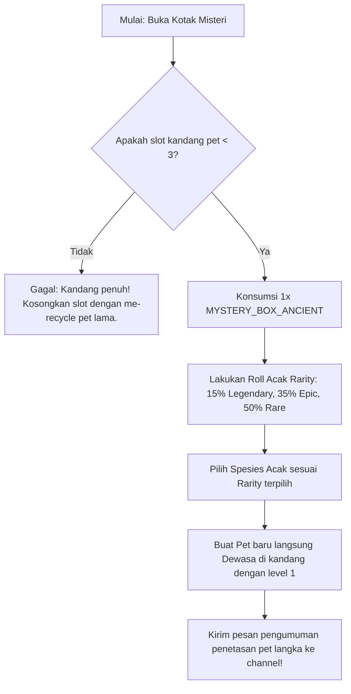

# Product Requirement Document (PRD)
## Fitur: Weekly Pet World Boss (Event Raid Boss Pet Mingguan)

| Dokumen Info | Detail |
| --- | --- |
| **Status** | Draft (Proposed) |
| **Penulis** | Antigravity AI |
| **Tanggal Pembuatan** | 4 Juni 2026 |
| **Target Rilis** | Sprint 9 (Sistem Raid & Hadiah Pet Langka) |
| **Target Platform** | Discord Bot (Sentinel Bot) |

---

## 1. Latar Belakang & Tujuan
Dengan dihapusnya batasan level pet (*uncapped level*) dan diperkenalkannya peta ekspedisi level tinggi, bot membutuhkan konten akhir (*end-game content*) yang menantang. Pemain yang telah melatih pet mereka hingga level tinggi membutuhkan musuh tangguh yang tidak bisa diselesaikan secara instan oleh individu saja.

Fitur **Weekly Pet World Boss** (Raid Boss Pet Mingguan) dirancang untuk memfasilitasi kebutuhan ini dengan memperkenalkan pertempuran kelompok (Raid) berskala besar. Fitur ini dirancang dengan:
- **Tingkat Kesulitan Ekstrim (High Difficulty):** Membutuhkan kerja sama tim (hingga 5 pemain) dengan rekomendasi level pet yang sangat tinggi dan risiko penalti berat jika gagal.
- **Imbalan Finansial Raksasa (Huge Rewards):** Hadiah koin Rupiah Server dalam jumlah besar untuk memacu antusiasme ekonomi warga.
- **Akses Pet Langka Acak (Random Rare Pet Drop):** Memberikan hadiah eksklusif berupa *Ancient Mystery Box* yang berisi telur pet tingkat *Rare*, *Epic*, atau *Legendary* acak guna meningkatkan keragaman koleksi pet pemain.

---

## 2. Deskripsi Fitur & Mekanisme Raid

Event Raid Boss akan aktif secara otomatis satu kali dalam seminggu di akhir pekan.

### 2.1 Jadwal Aktivitas (Active Schedule)
- **Kemunculan Boss:** Jumat pukul 18:00 WIB.
- **Batas Waktu Pertempuran:** Minggu pukul 23:59 WIB.
- **Pembersihan Log & Reset:** Senin pukul 00:00 WIB (Sistem membersihkan antrean pendaftaran untuk minggu berikutnya).

### 2.2 Mekanisme Pendaftaran & Partisipasi (Raid Entry)
- Perintah Pendaftaran: `.pet boss register <nama_pet>`
- **Biaya Pendaftaran (Entry Fee):** Rp 2.500 per pet (Dipotong langsung dari saldo dompet pemain saat registrasi, berfungsi sebagai *money sink*).
- **Syarat Kelayakan:** 
  - Pet harus berstatus Dewasa (`ADULT` / Level $\ge$ 10).
  - HP Pet harus penuh (100% dari HP Maksimal).
  - Pemain hanya dapat mendaftarkan **1 pet aktif** per minggu untuk bertempur di dalam Tim Raid.
- **Ukuran Tim Raid:** Minimal 3 pet dan maksimal 5 pet dari pemain yang berbeda untuk memulai pertempuran.

### 2.3 Tingkat Kesulitan Ekstrim & Penalti (High Difficulty & Risk)
- **Rekomendasi Level Boss:** Level 80+.
- **Penalti Selisih Level:** Jika ada pet peserta dengan level di bawah rekomendasi Boss, tim akan mendapatkan penalti peluang sukses sebesar **-5% per selisih level**.
- **Kondisi Pasca Pertarungan (Terlepas Menang/Kalah):**
  - **Kelelahan Ekstrim:** Seluruh pet yang ikut bertempur akan langsung kehilangan **80% HP** mereka secara instan.
  - **Risiko Cedera (Jika Kalah):** Jika tim gagal mengalahkan Boss, ada peluang **30%** bagi masing-masing pet peserta untuk terkena efek status **SICK** (Sakit) atau **INJURED** (Terluka), yang melarang mereka bekerja/berburu sampai disembuhkan menggunakan `MEDICINE` (seharga Rp 500).
  - **Risiko Kematian:** Jika HP pet turun hingga 0 dalam simulasi pertarungan akibat gagal, pet akan mati (`DEAD`) kecuali jika dilindungi oleh aksesoris `LUCKY_AMULET`.

### 2.4 Daftar Raid Boss Mingguan (Weekly Boss Pool)
Setiap hari Jumat pukul 18:00 WIB, sistem akan mengundi satu dari tiga World Boss berikut untuk dihadapi:

| Nama Boss | Elemen Boss | Rekomendasi Level | Peluang Sukses Dasar | Skill Pasif Khusus |
| :--- | :---: | :---: | :---: | :--- |
| ☄️ **Void Colossus** | DRAGON | 80 | 45% | **Gravity Well:** Mengurangi sukses rate dasar sebesar -15% jika tim tidak memiliki pet bertipe Legendaris (`LEVIATHAN`, `BEHEMOTH`, `ARCHDRAGON`). |
| 🌋 **Magma Dragon Lord** | FIRE | 90 | 35% | **Supernova:** Memberikan penalti peluang sukses sebesar -20% untuk pet peserta berelemen `WATER` (Air menguap seketika oleh panas ekstrem). |
| 🌪️ **Storm Leviathan** | WATER | 100 | 25% | **Abyssal Tempest:** Pet berelemen `EARTH` mendapatkan penalti sukses -20% (Tanah hancur tersapu badai tsunami kolosal). |

---

## 3. Sistem Imbalan & Drop Pet Langka

### 3.1 Hadiah Koin Raksasa (Huge Coin Reward)
Jika tim berhasil mengalahkan Boss, mereka akan mendapatkan jackpot koin:
- **Rentang Hadiah Tim:** Rp 15.000 s/d Rp 35.000.
- **Sistem Pembagian:** Hadiah total diundi secara acak di dalam rentang tersebut, kemudian **dibagi rata** ke saldo dompet masing-masing peserta tim yang berpartisipasi.

### 3.2 Ancient Mystery Box (`MYSTERY_BOX_ANCIENT`)
Setiap pemain dalam tim yang sukses mengalahkan Boss dijamin mendapatkan **1x Kotak Misteri Kuno (`MYSTERY_BOX_ANCIENT`)** yang masuk ke dalam `user_inventory`.
- **Mekanisme Pembukaan:** Pemain mengetik perintah `.use item MYSTERY_BOX_ANCIENT` untuk membuka kotak.
- Kotak ini akan hancur dan melahirkan/menetaskan **1 Pet Langka Acak** tingkat dewasa/telur langsung ke kandang pemain (jika slot kandang yang tersisa masih tersedia, maksimal 3 pet).
- **Peluang Spesies & Rarity Drop (Randomized):**

  | Rarity | Peluang Drop | Spesies Pilihan |
  | :--- | :---: | :--- |
  | 🟢 **RARE** | **50%** | `DRAGON` (Naga Api) |
  | 🟣 **EPIC** | **35%** | `PHOENIX` (Burung Abadi) atau `TURTLE` (Kura-Kura Bumi) |
  | 🟡 **LEGENDARY** | **15%** | `LEVIATHAN` (Naga Air), `BEHEMOTH` (Raksasa Bumi), atau `ARCHDRAGON` (Naga Purba) |

---

## 4. UI/UX & Alur Interaksi Pengguna

### 4.1 Perintah Utama (`.pet boss` / `.pet raid`)
Menampilkan embed status World Boss yang sedang aktif minggu ini:
```
👾 WEEKEND WORLD RAID BOSS 👾
━━━━━━━━━━━━━━━━━━━━━━━━━━━
Boss Minggu Ini: 🌋 Magma Dragon Lord
Elemen: FIRE  |  Rekomendasi Level: 90
Peluang Sukses Dasar: 35%

🔥 Skill Boss: [Supernova] Pet berelemen WATER terkena pinalti -20% sukses!
⏱️ Sisa Waktu: 2 Hari 5 Jam (Berakhir: Minggu 23:59 WIB)

👥 Tim Raid Saat Ini (3/5 Pet Terdaftar):
1. 🦖 Bahamut (Owner: @JoeFany) - Level 95 [DRAGON]
2. 🦅 Ignis (Owner: @WargaKosan) - Level 88 [PHOENIX]
3. 🧱 Rocky (Owner: @Developer) - Level 90 [GOLEM]

💰 Biaya Registrasi: Rp 2.500
[ ⚔️ Daftar Pet Aktif ]  [ 🚀 Mulai Pertempuran Raid ]
```

### 4.2 Log Pertarungan Raid (Battle Log Embed)
Ketika pertempuran dimulai, bot akan mengirimkan pesan loading interaktif dan menampilkan log simulasi pertempuran dramatis menggunakan format ANSI code (tulisan berwarna) di Discord:
```
⚔️ SIMULASI PERTEMPURAN RAID WORLD BOSS ⚔️
━━━━━━━━━━━━━━━━━━━━━━━━━━━━━━━━━━━━
[ROUND 1] Tim maju menyerang!
> 🦖 Bahamut menerjang menggunakan Cakar Naga! Boss terkena -500 DMG!
> 🌋 Magma Dragon Lord mengaum! Menyemburkan lava panas ke area pertempuran!
> Tim menerima dampak panas ekstrim. HP Tim menurun!

[ROUND 2] Fase Kritis Boss Skill!
> 🌋 Magma Dragon Lord memicu skill [Supernova]!
> 💥 Ledakan magmatik besar menyapu area! Peluang sukses turun!

[BATTLE RESULT]
> 🎉 TIM BERHASIL MENGALAHKAN MAGMA DRAGON LORD! 🎉
> Hadiah Jackpot Rp 25.000 telah dibagi rata ke 3 peserta (Masing-masing +Rp 8.333).
> Setiap peserta mendapatkan 🎁 1x Kotak Misteri Kuno!
```

### 4.3 Alur Aktivasi & Pembukaan Hadiah



---

## 5. Rencana Spesifikasi Teknis & Skema Database

### 5.1 Penambahan Item Baru (`PET_ITEMS`)
Tambahkan item `MYSTERY_BOX_ANCIENT` di array `PET_ITEMS` pada file `stockmarket/pet.js`:
```javascript
MYSTERY_BOX_ANCIENT: {
  id: 'MYSTERY_BOX_ANCIENT',
  name: '🎁 Kotak Misteri Peliharaan Kuno',
  price: 0, // Tidak dijual bebas di toko
  type: 'CONSUMABLE',
  desc: 'Kotak hadiah legendaris dari kekalahan Raid Boss. Buka untuk menetaskan pet langka acak!'
}
```

### 5.2 Skema Database Baru (`pet_raid_registrations`)
Buat tabel baru di database SQLite untuk menampung pendaftaran tim mingguan:
```sql
CREATE TABLE IF NOT EXISTS pet_raid_registrations (
    id INTEGER PRIMARY KEY AUTOINCREMENT,
    guild_id TEXT NOT NULL,
    user_id TEXT NOT NULL,
    pet_name TEXT NOT NULL,
    registered_at INTEGER NOT NULL
);
```

### 5.3 Fungsi Eksekusi Raid (`executeWorldRaid`)
Fungsi inti baru untuk menghitung probabilitas kemenangan tim raid:
1.  Ambil seluruh pet dari `pet_raid_registrations`.
2.  Hitung **Team Power** (rata-rata level pet) dan bandingkan dengan rekomendasi level Boss aktif.
3.  Hitung penalti level dan penalti kecocokan elemen (berdasarkan skill Boss).
4.  Lakukan roll sukses (angka acak $0.0 - 1.0$). Jika sukses $\le$ Peluang Sukses Akhir: Tim Menang.
5.  Berikan koin hasil pembagian jackpot ke masing-masing dompet via `economy.addBalance`.
6.  Berikan item `MYSTERY_BOX_ANCIENT` ke tabel `pet_inventory` masing-masing peserta.
7.  Kurangi HP seluruh pet peserta sebesar 80% (update tabel `user_pets`). Jika HP mencapai 0, proses kematian pet jika tidak membawa `LUCKY_AMULET`.
8.  Hapus antrean pendaftaran di `pet_raid_registrations`.

---

## 6. Rencana Verifikasi

### 6.1 Uji Coba Otomatis (Raid Battle Simulation)
Membuat skrip pengujian `scratch/test_boss_raid_simulation.js`:
- Menyimulasikan pendaftaran 3 hingga 5 pet dengan variasi level (di bawah 80, di sekitar 90, dan di atas 100).
- Menghitung keakuratan kalkulasi kesuksesan, pemotongan HP, pembagian koin, serta drop rate Kotak Misteri Kuno.
- Menyimulasikan pembukaan Kotak Misteri Kuno sebanyak 5.000 kali untuk memastikan persentase drop rate spesies Rare (50%), Epic (35%), dan Legendary (15%) sesuai dengan spesifikasi yang dirancang.

### 6.2 Uji Coba Manual
- Mendaftarkan pet lewat Discord menggunakan command `.pet boss register`.
- Menyimulasikan eksekusi pertempuran saat tim penuh (5 pet) dan memastikan log pertempuran ANSI terkirim dengan estetika premium.
- Menguji skenario kegagalan: Memastikan pet menerima penalti kehilangan 80% HP, dan mengecek apakah status sakit (`SICK`) terpicu dengan benar.
