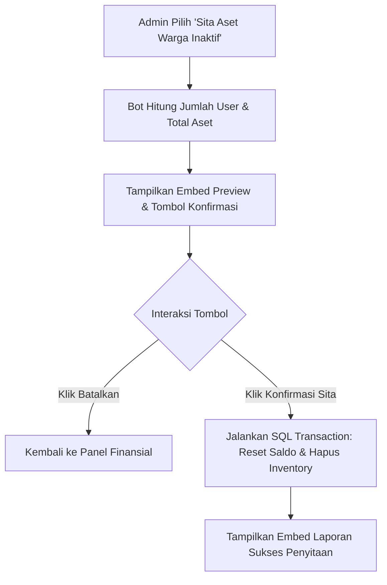

# Product Requirement Document (PRD)
## Fitur: Penarikan Aset Warga Inaktif (Never Daily) via `.adminpanel`

| Dokumen Info | Detail |
| --- | --- |
| **Status** | Draft |
| **Penulis** | Antigravity AI |
| **Tanggal Pembuatan** | 4 Juni 2026 |
| **Target Rilis** | Fitur Administrasi & Ekonomi |
| **Target Platform** | Discord Bot (Sentinel Bot) |

---

## 1. Latar Belakang & Tujuan
Dalam sistem simulasi ekonomi Discord, terdapat sejumlah warga/pemain baru yang masuk ke server, memperoleh bonus koin/item awal, namun **tidak pernah melakukan klaim harian (`daily`)** atau tidak pernah aktif berpartisipasi dalam perekonomian. Hal ini berdampak pada:
- **Inflasi Koin Semu:** Ada akumulasi koin pasif di dalam database milik akun-akun inaktif yang dapat mengaburkan nilai peredaran uang asli (*active money supply*).
- **Penumpukan Data (Database Bloat):** Banyak baris data inventaris dan saldo bank pasif yang tidak pernah diakses.
- **Kebutuhan Regulasi Ekonomi:** Admin memerlukan alat kontrol langsung dari `.adminpanel` untuk melakukan penyitaan/penarikan massal terhadap aset (uang dan item) dari pemain inaktif ini guna menyeimbangkan ekosistem ekonomi server.

---

## 2. Definisi "Pemain Inaktif (Never Daily)"
Seorang pemain dikategorikan sebagai **"Tidak Pernah Daily" (Never Daily)** jika memenuhi kriteria berikut pada tabel database `wallets`:
- Kolom `last_active_date` bernilai **kosong** (`''`) atau **NULL**.
- Terdaftar dalam database pada `guild_id` yang bersangkutan.

---

## 3. Ruang Lingkup Tindakan Penarikan Aset
Ketika tindakan pembersihan diaktifkan oleh administrator, sistem akan melakukan penyitaan aset secara menyeluruh:
1. **Saldo Dompet (Wallet Balance):** Mengubah nilai `balance` dan `total_earned` di tabel `wallets` menjadi `0`.
2. **Saldo Tabungan Bank (Bank Savings):** Mengubah nilai `balance` di tabel `bank_savings` menjadi `0`.
3. **Item Inventaris Umum (User Inventory):** Menghapus seluruh baris data item milik pemain tersebut dari tabel `user_inventory`.
4. **Item Inventaris Peliharaan (Pet Inventory):** Menghapus seluruh baris data item makanan/obat peliharaan milik pemain tersebut dari tabel `pet_inventory`.

> [!NOTE]
> Sebagai kebijakan desain tambahan, data hewan peliharaan (`user_pets`) tidak dihapus secara otomatis demi mencegah kehilangan data permanen jika pemain tersebut memutuskan untuk kembali di masa mendatang (mereka hanya akan kehilangan modal uang dan item pendukungnya).

---

## 4. Spesifikasi UI/UX & Alur Interaksi Pengguna

### 4.1 Integrasi Menu Utama `.adminpanel`
Fitur ini akan ditempatkan di dalam sub-panel **Bank & Finansial** (`handleAdminBankPanel`) pada bagian dropdown **Tindakan Ekonomi Global** (`admin_bank_select_global`).

- **Opsi Menu Baru:** `global_reclaim_inactive_assets`
- **Label Menu:** `🔴 Sita Aset Warga Inaktif (Never Daily)`
- **Deskripsi Menu:** `Menyita koin dompet, saldo bank, dan seluruh item warga yang tidak pernah klaim daily`

### 4.2 Alur Konfirmasi & Eksekusi (User Flow)
Untuk menghindari kesalahan fatal akibat salah klik, tindakan eksekusi tidak boleh langsung berjalan. Sistem harus menyajikan **Embed Preview & Konfirmasi**:

1. **Pemicu:** Admin memilih opsi `global_reclaim_inactive_assets` dari dropdown menu.
2. **Kalkulasi & Preview:** Bot melakukan query `SELECT` awal untuk menghitung:
   - Jumlah total warga yang berstatus *Never Daily*.
   - Akumulasi total koin dompet yang akan disita.
   - Akumulasi total koin tabungan bank yang akan disita.
   - Jumlah total item dalam inventaris yang akan dihapus.
3. **Tampilan Panel Konfirmasi:** Bot mengirimkan embed konfirmasi berwarna merah cerah (Warning/Danger) beserta tombol interaksi:
   - Tombol **`⚠️ Konfirmasi Sita`** (Style: Danger/Merah)
   - Tombol **`❌ Batalkan`** (Style: Secondary/Abu-abu)
4. **Eksekusi:**
   - Jika admin klik **`⚠️ Konfirmasi Sita`**, proses transaksi database dijalankan secara atomik. Bot kemudian memperbarui embed dengan detail ringkasan hasil penyitaan yang sukses.
   - Jika admin klik **`❌ Batalkan`**, bot membatalkan operasi dan kembali ke tampilan panel Finansial biasa.



---

## 5. Implementasi Teknis & Logika Database

### 5.1 Query Preview Aset
Untuk menghitung perkiraan aset yang akan disita sebelum eksekusi dilakukan:
```sql
SELECT 
    COUNT(w.user_id) as total_users,
    SUM(w.balance) as total_wallet_coins,
    SUM(COALESCE(bs.balance, 0)) as total_bank_coins,
    (
        SELECT COALESCE(SUM(ui.quantity), 0) 
        FROM user_inventory ui 
        WHERE ui.guild_id = w.guild_id AND ui.user_id IN (
            SELECT user_id FROM wallets WHERE guild_id = w.guild_id AND (last_active_date IS NULL OR last_active_date = '')
        )
    ) as total_user_items,
    (
        SELECT COALESCE(SUM(pi.quantity), 0) 
        FROM pet_inventory pi 
        WHERE pi.guild_id = w.guild_id AND pi.user_id IN (
            SELECT user_id FROM wallets WHERE guild_id = w.guild_id AND (last_active_date IS NULL OR last_active_date = '')
        )
    ) as total_pet_items
FROM wallets w
LEFT JOIN bank_savings bs ON w.user_id = bs.user_id AND w.guild_id = bs.guild_id
WHERE w.guild_id = ? AND (w.last_active_date IS NULL OR w.last_active_date = '');
```

### 5.2 Query Eksekusi Sita Aset (SQLite Transaction)
Operasi penyitaan harus dibungkus di dalam `database.transaction()` untuk memastikan integritas data jika terjadi error di tengah jalan:

```javascript
database.transaction(() => {
  // 1. Hapus semua item di user_inventory milik user target
  database.prepare(`
    DELETE FROM user_inventory 
    WHERE guild_id = ? AND user_id IN (
      SELECT user_id FROM wallets WHERE guild_id = ? AND (last_active_date IS NULL OR last_active_date = '')
    )
  `).run(guildId, guildId);

  // 2. Hapus semua item di pet_inventory milik user target
  database.prepare(`
    DELETE FROM pet_inventory 
    WHERE guild_id = ? AND user_id IN (
      SELECT user_id FROM wallets WHERE guild_id = ? AND (last_active_date IS NULL OR last_active_date = '')
    )
  `).run(guildId, guildId);

  // 3. Reset saldo tabungan di bank_savings milik user target
  database.prepare(`
    UPDATE bank_savings 
    SET balance = 0 
    WHERE guild_id = ? AND user_id IN (
      SELECT user_id FROM wallets WHERE guild_id = ? AND (last_active_date IS NULL OR last_active_date = '')
    )
  `).run(guildId, guildId);

  // 4. Reset koin di wallets milik user target
  database.prepare(`
    UPDATE wallets 
    SET balance = 0, total_earned = 0 
    WHERE guild_id = ? AND (last_active_date IS NULL OR last_active_date = '')
  `).run(guildId);
})();
```

---

## 6. Rencana Pengujian & Verifikasi

### 6.1 Skenario Pengujian Manual
1. **Skenario 1 (Pengecekan Filter):** Buat akun uji coba baru yang belum pernah mengambil daily (kolom `last_active_date` kosong). Isi dompet, bank, dan inventarisnya dengan koin/item kustom. Pastikan akun ini masuk dalam perhitungan preview penyitaan.
2. **Skenario 2 (Abaikan Akun Aktif):** Buat akun uji coba kedua yang sudah pernah daily (mengisi `last_active_date`). Pastikan data koin dan inventaris akun ini **tidak ikut tersita** atau berkurang.
3. **Skenario 3 (Pembatalan Aksi):** Buka menu, klik opsi sita, lalu klik tombol **`Batalkan`**. Verifikasi bahwa tidak ada perubahan pada database dan admin dikembalikan ke menu finansial.
4. **Skenario 4 (Eksekusi Penuh):** Jalankan aksi penyitaan, verifikasi di database (`wallets`, `bank_savings`, `user_inventory`, `pet_inventory`) bahwa data akun *Never Daily* berhasil dibersihkan/direset ke `0`, sementara akun aktif tetap aman.
