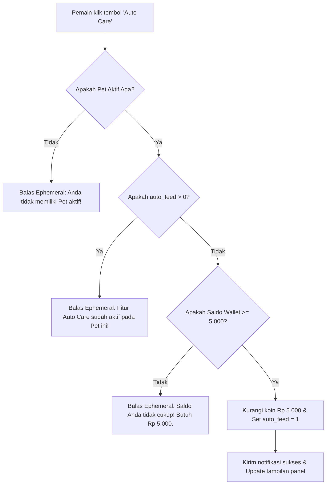

# Product Requirement Document (PRD)
## Fitur: Pet Auto Care (`.pet auto-care`)

| Dokumen Info | Detail |
| --- | --- |
| **Status** | Approved |
| **Penulis** | Antigravity AI |
| **Tanggal Pembuatan** | 2 Juni 2026 |
| **Target Rilis** | Sprint 6 (Peliharaan & Ekonomi) |
| **Target Platform** | Discord Bot (Sentinel Bot) |

---

## 1. Latar Belakang & Tujuan
Saat ini, banyak pemain yang kehilangan hewan peliharaan mereka (pet mati / `DEAD`) karena lupa melakukan interaksi manual untuk memberi makan/minum secara teratur.
Meskipun terdapat fitur VIP Auto Care (`auto_feed = 2`) yang gratis untuk kalangan terbatas, sistem membutuhkan fitur berbayar satu-kali (one-time buy) untuk seluruh pemain biasa (`auto_feed = 1`) seharga **Rp 5.000** koin untuk mengaktifkan perawatan otomatis. Hal ini berfungsi sebagai:
- **Money Sink:** Menyerap koin yang beredar di dalam perekonomian server.
- **Convenience Feature:** Memberikan opsi kenyamanan bagi pemain non-VIP agar pet mereka aman saat ditinggal offline.

---

## 2. Deskripsi Fitur & Fungsionalitas

### 2.1 Pembelian & Pembukaan Fitur (Unlock)
- **Biaya:** Rp 5.000 (Potong langsung dari Saldo Dompet/Wallet pemain).
- **Sifat:** Pembelian bersifat permanen per pet aktif yang dipilih.
- **Validasi:**
  - Pemain harus memiliki pet aktif.
  - Saldo dompet harus $\ge$ Rp 5.000.
  - Fitur tidak dapat dibeli kembali jika status auto-care pet sudah aktif (`auto_feed = 1` atau `auto_feed = 2`).

### 2.2 Mekanisme Auto Care (Decay Integration)
Ketika status `auto_feed` bernilai `1` (Berbayar) atau `2` (VIP), sistem perhitungan kemunduran status (*decay calculator*) akan bertindak sebagai berikut:
- **Pengecekan Berkala:** Setiap jam simulasi decay berlangsung, jika tingkat kenyang (*hunger*) atau tingkat hidrasi (*thirst*) turun di bawah atau sama dengan **50%**:
  - **Pemulihan Status:**
    - Lapar naik sebesar **+30%** (maksimal 100%).
    - Haus naik sebesar **+35%** (maksimal 100%).
- **Konsumsi Sumber Daya (Koin):**
  - VIP Auto Care (`auto_feed = 2`): Pemulihan status gratis tanpa memotong saldo koin.
  - Standard Auto Care (`auto_feed = 1`): Pemulihan status otomatis memotong saldo dompet sebesar **Rp 150** untuk pakan (`FOOD_BASIC`) dan **Rp 100** untuk air bersih (`WATER`) setiap kali terpicu. Jika saldo dompet tidak mencukupi saat decay berlangsung, pemulihan otomatis diabaikan dan pet akan mengalami kelaparan/kehausan secara normal.

---

## 3. UI/UX & Alur Interaksi Pengguna

### 3.1 Penambahan Menu di Panel Utama `.pet`
Pada menu kontrol utama `.pet` (ephemeral panel), akan ditambahkan tombol interaktif baru:
- **Tombol:** `🤖 Auto Care`
- **Label Status Dinamis:**
  - Jika belum dibuka: `🤖 Auto Care (Rp 5.000)` (Style: Secondary)
  - Jika sudah aktif (Berbayar/VIP): `🤖 Auto Care: AKTIF` (Style: Success, Disabled)

### 3.2 Alur Pembelian (User Flow)

---

## 4. Spesifikasi Teknis & Skema Database

### 4.1 Kolom Tabel Database (`user_pets`)
Fitur ini memanfaatkan kolom `auto_feed` pada tabel `user_pets` yang sudah ada:
- **Tipe Data:** `INTEGER`
- **Nilai Status:**
  - `0` = Nonaktif (Default)
  - `1` = Aktif Berbayar (Standard Auto Care)
  - `2` = Aktif VIP (VIP Auto Care)

### 4.2 Integrasi Kode
1. **Fungsi Decay (`stockmarket/pet.js`):**
   Memperbarui percabangan pengecekan `auto_feed` pada `applyDecay(pet)` untuk memproses pemotongan koin untuk `auto_feed = 1`.
2. **Fungsi Transaksi & Aktivasi (`stockmarket/pet.js`):**
   Membuat fungsi `unlockAutoCare(userId, guildId)` untuk menangani transaksi pembukaan fitur seharga Rp 5.000.
