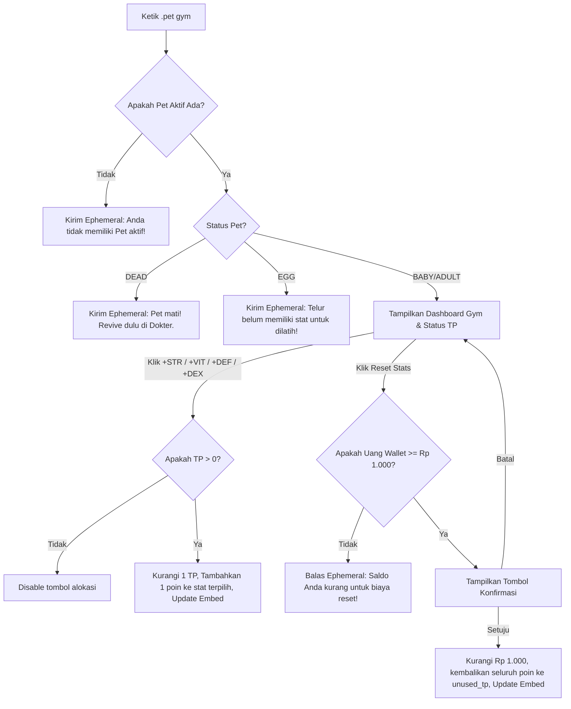

# Product Requirement Document (PRD)
## Fitur: Sistem Kustomisasi Stat Pet & Pusat Kebugaran (`.pet gym`)

| Dokumen Info | Detail |
| --- | --- |
| **Status** | Draft (Proposed) |
| **Penulis** | Antigravity AI |
| **Tanggal Pembuatan** | 5 Juni 2026 |
| **Target Rilis** | Sprint 8 (Sistem RPG & Kustomisasi Karakter) |
| **Target Platform** | Discord Bot (Sentinel Bot) |

---

## 1. Latar Belakang & Tujuan
Dengan diperkenalkannya level tanpa batas (*uncapped pet level*), pet dapat terus bertumbuh tanpa batas buatan. Namun, saat ini stat pet (Max HP, ATK, DEF) bersifat kaku dan terikat secara otomatis berdasarkan level dan tingkat bintang pet. Semua pet dengan spesies yang sama pada level yang sama akan memiliki kekuatan yang identik.

Untuk menambah kedalaman gameplay bergenre RPG, diperlukan fitur **Sistem Kustomisasi Stat Pet & Pusat Kebugaran (`.pet gym`)**. Fitur ini akan memberikan kebebasan kepada pemain untuk melatih dan membentuk atribut pet mereka secara unik (misalnya membangun tipe DPS murni, Tank berdarah tebal, atau Penjelajah ekspedisi yang lincah). 

**Tujuan Fitur Ini:**
- **RPG Depth:** Memberikan variasi gaya bermain dan kustomisasi pet yang mendalam.
- **Synergy:** Memaksimalkan utilitas kenaikan level pet (leveling) dan status bintang pet. Koin yang digunakan untuk mereset stat juga berfungsi sebagai *money sink* tambahan bagi ekonomi server.
- **Combat Impact:** Memengaruhi performa pet secara signifikan dalam pertempuran PvP Arena, Ekspedisi Peta 5-10, dan pertempuran Raid World Boss mingguan.

---

## 2. Deskripsi Fitur & Mekanisme Utama

Setiap kali pet naik level, ia akan mendapatkan poin latihan yang dapat dialokasikan ke empat atribut utama.

### 2.1 Training Points (TP)
- **Perolehan TP:** Pet mendapatkan **+3 TP** setiap kali naik level (sejak level 2 ke atas).
- **Kompensasi Retroaktif (Retroactive TP):** Ketika fitur ini dirilis, sistem akan secara otomatis menghitung dan memberikan TP kepada pet yang sudah memiliki level tinggi dengan formula:
  $$TP\_Tersedia = (Level - 1) \times 3$$
- Poin yang belum dialokasikan akan disimpan dalam kolom `unused_tp`.

### 2.2 Atribut Stat & Dampak Mekanis
Pemain dapat mendistribusikan TP ke 4 atribut dasar berikut:

1. **Strength (STR) - Kekuatan:**
   - **Deskripsi:** Meningkatkan daya serang pet secara mentah.
   - **Efek:** $+2$ Base ATK per poin STR.
   - **Dampak Formula ATK:**
     $$Base\_ATK = Species\_Base\_ATK + (Level \times 5) + (STR \times 2)$$

2. **Vitality (VIT) - Ketahanan Hidup:**
   - **Deskripsi:** Meningkatkan kapasitas kesehatan maksimal pet.
   - **Efek:** $+3$ Max HP per poin VIT.
   - **Dampak Formula Max HP:**
     $$Max\_HP = Species\_Base\_HP + (StarLevel - 1) \times 15 + (VIT \times 3)$$

3. **Defense (DEF) - Pertahanan:**
   - **Deskripsi:** Mengurangi kerusakan yang diterima pet dalam pertarungan.
   - **Efek:** $+0.5\%$ Damage Reduction per poin DEF (maksimal $50\%$ reduksi dari alokasi DEF atau setara 100 DEF).
   - **Dampak Formula Reduksi Damage (PvP & Boss):**
     $$DEF\_Multiplier = (1.0 - (Base\_DEF / 100)) \times (1.0 - (DEF \times 0.005)) \times (1.0 - StarBonus\_DEF)$$

4. **Dexterity (DEX) - Kelincahan & Presisi:**
   - **Deskripsi:** Meningkatkan akurasi, peluang serangan kritis (*Critical Strike*), dan kecerdasan menghindari bahaya.
   - **Efek:** 
     - **Crit Rate (PvP):** $+0.5\%$ peluang mendaratkan serangan kritis (Crit damage $= 1.5\times$ DMG biasa). Maksimal $35\%$ Crit Rate (70 DEX).
     - **Bonus Sukses Ekspedisi:** $+0.1\%$ peluang sukses flat per poin DEX (maksimal $+5\%$ sukses rate pada 50 DEX).

---

### 2.3 Reset Stat (Pusat Rehabilitasi Gym)
Pemain dapat mengatur ulang seluruh alokasi stat pet aktif mereka kembali ke status kosong (TP dikembalikan utuh ke `unused_tp`).
- **Biaya:** Rp 1.000 koin per reset (dipotong dari saldo dompet).
- **Batasan:** Hanya dapat dilakukan pada pet aktif berstatus hidup (`BABY` atau `ADULT`).

---

### 2.4 Kontrol Administratif Pet Gym (Admin Panel Actions)
Untuk keperluan pengujian, kompensasi, dan pengelolaan oleh staf, fitur ini terintegrasi penuh ke dalam **Admin Control Panel Pet** (`.pet-admin` / `.pet admin`). Tindakan administratif baru yang ditambahkan meliputi:

1. **Inject/Set Unused TP (`action_set_unused_tp_modal`):**
   - **Deskripsi:** Admin dapat mengatur ulang atau menambah jumlah poin latihan (`unused_tp`) yang belum terpakai pada pet target secara instan melalui modal input angka.
   - **Guna:** Memberikan kompensasi poin latihan atau melakukan debugging stat pet dengan mudah.

2. **Modifikasi Stat Dasar (`action_set_gym_stats_modal`):**
   - **Deskripsi:** Membuka sebuah modal dengan 5 field input teks (Strength, Vitality, Defense, Dexterity, dan Unused TP) untuk langsung menimpa status alokasi stat dan sisa poin latihan pet target secara bersamaan.
   - **Guna:** Mempermudah admin melakukan penyesuaian status pet secara presisi tanpa perlu melatih pet secara manual satu per satu.

3. **Reset Stat Gratis (`action_admin_reset_gym`):**
   - **Deskripsi:** Mengembalikan seluruh alokasi stat pet target ke 0 dan memindahkan poin kembali ke `unused_tp` secara gratis tanpa memotong koin wallet user.
   - **Guna:** Membantu user yang mengalami kesalahan alokasi poin akibat bug atau reset massal oleh admin.

---

## 3. UI/UX & Alur Interaksi Pengguna

### 3.1 Perintah Utama: `.pet gym`
Membuka dashboard interaktif (ephemeral embed) khusus untuk manajemen stat pet aktif saat ini.

#### Tampilan Embed:
```
🏋️ PUSAT KEBUGARAN & STATS PET: Ciko 🏋️
━━━━━━━━━━━━━━━━━━━━━━━━━━━━━━━━━━━━━━
🐾 Jenis: Dragon (Lv. 35) | ⭐⭐⭐ (Bintang 3)
✨ Poin Latihan Tersedia (TP): 🔴 12 Poin

📊 ATRIBUT STAT SAAT INI:
💪 STR (Kekuatan) : 15  (+30 ATK)
❤️ VIT (Vitalitas): 20  (+60 Max HP)
🛡️ DEF (Pertahanan): 10 (+5.0% DMG Reduction)
⚡ DEX (Kelincahan): 5  (+2.5% Crit Rate | +0.5% Sukses Eksp)

🔥 TOTAL STATUS COMBAT:
• ❤️ Max HP: 190 HP
• ⚔️ ATK Damage: 220 ATK
• 🛡️ Damage Reduction: 12.5% (Base + Gym)
• ⚡ Crit Rate: 2.5%

💰 Biaya Reset Stat: Rp 1.000
━━━━━━━━━━━━━━━━━━━━━━━━━━━━━━━━━━━━━━
[ 💪 +STR ]  [ ❤️ +VIT ]  [ 🛡️ +DEF ]  [ ⚡ +DEX ]
[ 🔄 Reset Stats (Rp 1.000) ]  [ ❌ Tutup Gym ]
```

- **Tombol Aksi (+STR, +VIT, +DEF, +DEX):** 
  - Setiap klik pada tombol stat akan memotong **1 TP** (atau membuka modal / dropdown jika ingin mengalokasikan sekaligus dalam jumlah besar demi efisiensi rate-limit Discord).
  - Untuk kepraktisan, klik tombol akan mengalokasikan **1 poin** dan memperbarui embed secara realtime. Jika TP habis, tombol alokasi akan ter-disable.
- **Tombol Reset Stats:** Meminta konfirmasi dengan tombol Yes/No sebelum memotong Rp 1.000 dan mengembalikan poin.

---

### 3.2 Alur Interaksi Pengguna (User Flow)



---

## 4. Rencana Spesifikasi Teknis & Skema Database

### 4.1 Modifikasi Skema Database (`user_pets`)
Menambahkan kolom baru pada tabel `user_pets` di `stockmarket/database.js` melalui mekanisme migrasi dinamis:
```sql
ALTER TABLE user_pets ADD COLUMN stat_str INTEGER DEFAULT 0;
ALTER TABLE user_pets ADD COLUMN stat_vit INTEGER DEFAULT 0;
ALTER TABLE user_pets ADD COLUMN stat_def INTEGER DEFAULT 0;
ALTER TABLE user_pets ADD COLUMN stat_dex INTEGER DEFAULT 0;
ALTER TABLE user_pets ADD COLUMN unused_tp INTEGER DEFAULT 0;
```

### 4.2 Integrasi Logika Kenaikan Level (`stockmarket/pet.js`)
Perbarui fungsi `addXp` atau di mana level up dieksekusi untuk menambahkan **+3 TP** ke kolom `unused_tp` pet setiap kali levelnya bertambah:
```javascript
// Di dalam apply level up
let tpGained = 0;
if (levelUp) {
  tpGained = (newLevel - pet.level) * 3;
}
// Query update akan menambahkan unused_tp = unused_tp + tpGained
```

### 4.3 Penyesuaian Formula Combat & Ekspedisi
1. **Dinamisasi `getMaxHP`:**
   ```javascript
   function getMaxHP(pet) {
     if (!pet) return 100;
     const speciesInfo = GACHA_SPECIES[pet.pet_type];
     const baseHP = speciesInfo ? (speciesInfo.baseHP || 100) : (pet.pet_type === 'SLIME' ? 120 : 100);
     const starLevel = pet.star_level || 1;
     const hpBonus = (starLevel - 1) * 15;
     const vitBonus = (pet.stat_vit || 0) * 3; // +3 HP per Vitality
     return baseHP + hpBonus + vitBonus;
   }
   ```

2. **Dinamisasi Pertempuran PvP (`executePvP`):**
   - Ambil `stat_str`, `stat_def`, dan `stat_dex` dari database.
   - Perbarui kalkulasi `Base_ATK` dengan menyertakan bonus STR.
   - Terapkan kalkulasi Damage Reduction (DEF) pada damage yang diterima:
     ```javascript
     const chalDefStat = challenger.stat_def || 0;
     const chalDefReduction = chalDefStat * 0.005; // 0.5% per poin
     const chalDamageTakenMult = (1.0 - (chalSpecBaseDef / 100)) * chalDefMult * (1.0 - (challenger.base_def_bonus_pct || 0.0)) * (1.0 - Math.min(0.50, chalDefReduction));
     ```
   - Terapkan logika serangan kritis (Crit Strike) berdasarkan DEX:
     ```javascript
     const chalDex = challenger.stat_dex || 0;
     const chalCritChance = Math.min(0.35, chalDex * 0.005); // Max 35% crit chance
     const isCrit = Math.random() < chalCritChance;
     let damage = baseDamage;
     if (isCrit) {
       damage = Math.round(damage * 1.5);
       logs.push(`💥 **CRITICAL HIT!** Serangan **${challenger.pet_name}** menembus titik vital lawan!`);
     }
     ```

3. **Dinamisasi Ekspedisi (`calculateSuccessRate`):**
   - DEX pet peserta dihitung untuk menambahkan kesuksesan dasar tim:
     ```javascript
     const dexBonus = Math.min(5.0, (pet.stat_dex || 0) * 0.1); // +0.1% per DEX, max +5% sukses rate
     successRate += dexBonus;
     ```

### 4.4 Modifikasi Kode Admin Control Panel (`stockmarket/adminPanel.js` & `stockmarket/index.js`)
1. **Pendaftaran Pilihan Baru di Select Menu Tindakan:**
   Tambahkan opsi tindakan baru pada `admin_pet_select_action` di `adminPanel.js`:
   * `action_set_unused_tp_modal`: "Set Unused TP Pet (Modal)"
   * `action_set_gym_stats_modal`: "Modifikasi Stat Gym Pet (Modal)"
   * `action_admin_reset_gym`: "Reset Stat Gym Pet (Gratis)"

2. **Pembuatan Modal Form Input Administratif:**
   * **`admin_pet_set_tp_modal`**: Input text `unused_tp` (Poin Latihan).
   * **`admin_pet_set_stats_modal`**: 5 input text: `stat_str` (Strength), `stat_vit` (Vitality), `stat_def` (Defense), `stat_dex` (Dexterity), dan `unused_tp` (Sisa Poin Latihan).

3. **Penanganan Event & Query Database:**
   * Ketika event handler menerima trigger tindakan `action_admin_reset_gym`, lakukan update database untuk mereset `stat_str = 0, stat_vit = 0, stat_def = 0, stat_dex = 0` dan menjumlahkan total stat tereset ke `unused_tp`.
   * Pada trigger submit modal `admin_pet_set_tp_modal` dan `admin_pet_set_stats_modal`, lakukan konversi input string ke integer, validasi batas input (angka $\ge 0$), lalu update database pada target pet terkait.

4. **Integrasi Command Chat (`stockmarket/index.js`):**
   * Tambahkan sub-command `.pet-admin set-tp @user <jumlah>` untuk modifikasi cepat lewat chat.
   * Tambahkan sub-command `.pet-admin set-stats @user <str> <vit> <def> <dex> [tp]` untuk override cepat.

---

## 5. Rencana Verifikasi

### 5.1 Uji Coba Otomatis (Simulation script)
Membuat skrip pengujian mandiri di folder `scratch/` untuk memvalidasi:
1. **Validasi Retroaktif TP:** Memastikan pet level tinggi (misal level 50) yang belum bermigrasi langsung mendapatkan `(50 - 1) * 3 = 147` TP saat database diinisiasi ulang.
2. **Kalkulasi Stat:** Memverifikasi bahwa HP maksimal ter-update dengan benar setelah ditambahkan poin VIT.
3. **Simulasi PvP & Dungeon:** Menjalankan 1.000 kali simulasi PvP untuk mengonfirmasi persentase kejadian serangan kritis (Crit Rate) dari pet dengan DEX tinggi cocok dengan target teoretis ($35\%$).

### 5.2 Uji Coba Manual
1. **Pengujian Sisi User:**
   * Membuka panel gym melalui bot menggunakan command `.pet gym`.
   * Mencoba menekan tombol alokasi stat (`+STR`, `+VIT`, dll) dan melihat apakah embed ter-update secara instan.
   * Melakukan `.pet gym reset`, memverifikasi pengurangan Rp 1.000 dari saldo dompet, dan memastikan seluruh TP kembali ke `unused_tp`.
2. **Pengujian Sisi Admin:**
   * Membuka panel admin pet melalui command `.pet-admin` atau panel admin utama.
   * Memilih opsi **"Set Unused TP Pet"** pada target user, menginput angka 50, dan memverifikasi sisa TP pet target bertambah 50 di `.pet gym`.
   * Memilih opsi **"Modifikasi Stat Gym Pet"**, mengisi kelima field dengan nilai kustom (misal STR=20, VIT=25, DEF=10, DEX=15, TP=5), lalu memverifikasi seluruh status pet target ter-update secara presisi di database.
   * Memilih opsi **"Reset Stat Gym Pet (Gratis)"**, memverifikasi stat kembali ke 0 tanpa pengurangan koin pada dompet target user.
   * Menjalankan perintah chat `.pet-admin set-tp @user 10` dan memastikan program memprosesnya dengan benar.
