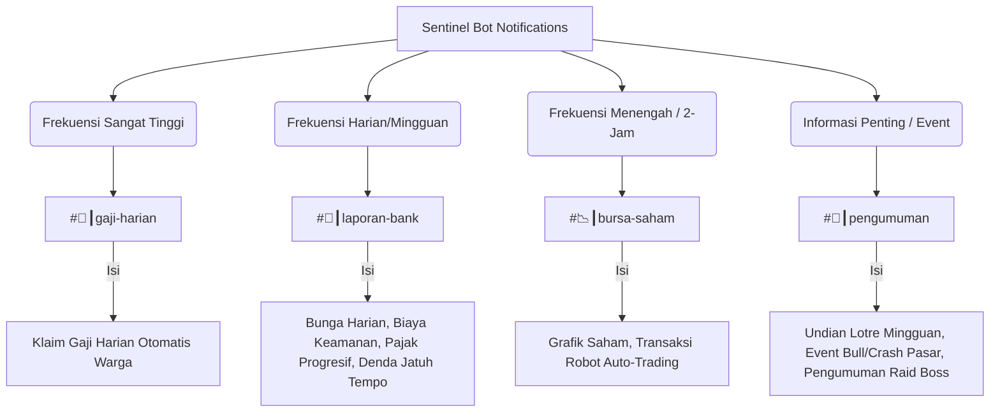

# Product Requirement Document (PRD)
## Fitur: Restrukturisasi & Manajemen Saluran Notifikasi Bot Terpadu

| Dokumen Info | Detail |
| --- | --- |
| **Status** | Draft (Proposed) |
| **Penulis** | Antigravity AI |
| **Tanggal Pembuatan** | 4 Juni 2026 |
| **Target Rilis** | Sprint 6 (Optimalisasi UX & Kerapihan Server) |
| **Target Platform** | Discord Server & Sentinel Bot |
| **Server ID Target** | `1410239829874053296` |

---

## 1. Latar Belakang & Masalah Utama
Saat ini, seluruh alur notifikasi bot (Sentinel Bot) berpusat pada satu saluran tunggal yaitu `#📉┃bursa-saham` (Channel ID: `1509480324373942272`). Hal ini menyebabkan beberapa masalah krusial:
1. **Penumpukan Informasi (Message Clutter):** Pergerakan harga saham (tiap 2 jam), laporan harian bank (tengah malam), notifikasi denda, bunga tabungan harian, undian lotre mingguan, hingga klaim **Gaji Harian Otomatis** warga tercampur dalam satu saluran.
2. **Spam Gaji Harian:** Setiap kali warga mengirim pesan pertama di hari tersebut, bot mengirimkan embed notifikasi klaim gaji otomatis ke channel bursa saham. Pada server aktif, hal ini menghasilkan ratusan pesan spam harian yang menimbun laporan penting saham dan perbankan.
3. **Mute Massal:** Karena channel bursa sangat berisik (tiap 2 jam mengirim grafik/laporan), mayoritas warga melakukan *Mute* pada saluran tersebut. Akibatnya, pengumuman penting seperti pemenang Lotre Mingguan atau event crash/bull bursa terlewatkan oleh warga.
4. **Redundansi Leaderboard:** Server saat ini memiliki 3 saluran leaderboard terpisah yang membuat daftar saluran Discord terlalu panjang dan tidak efisien.

PRD ini bertujuan untuk merancang ulang struktur notifikasi secara terpisah agar lebih rapi, terorganisir, serta menghapus saluran/notifikasi yang tidak lagi dibutuhkan.

---

## 2. Audit Saluran & Alur Notifikasi Saat Ini

Berdasarkan audit basis kode [index.js](file:///Users/joefany/bot-discord-2026/index.js) dan [stockmarket/scheduler.js](file:///Users/joefany/bot-discord-2026/stockmarket/scheduler.js), berikut adalah saluran khusus yang saat ini terdaftar:

| Channel ID | Nama/Fungsi Sistem | Status Akses Perintah Bot | Masalah / Temuan |
| :--- | :--- | :--- | :--- |
| `1510121069783023646` | `#🛍️┃shop` (Portal Dashboard) | **Terblokir** (Perintah dibersihkan) | Sudah rapi, berfungsi sebagai dashboard portal statis. |
| `1422642326798598348` | `💬┃living-room` (Gaji & Chat Utama) | **Terblokir** (Perintah dialihkan) | Berfungsi sebagai chat utama sekaligus greeting. |
| `1472428770710261952` | `🎭┃spill-the-tea` (Saham $STE) | **Terblokir** (Perintah dibersihkan) | Saluran chat biasa terdaftar sebagai instrumen saham. |
| `1422656689710305381` | `📸┃luxury-gallery` (Saham $LUX) | **Terblokir** (Perintah dibersihkan) | Saluran chat biasa terdaftar sebagai instrumen saham. |
| `1509480324373942272` | `#📉┃bursa-saham` (Notifikasi Utama) | **Terblokir** (Perintah dibersihkan) | **Overcrowded!** Menampung 9 jenis notifikasi berbeda. |
| `1510230591860113418` | Papan Peringkat 1 | Administrator Only | Redundan (Terdapat 3 saluran leaderboard terpisah). |
| `1510232295448117308` | Papan Peringkat 2 | Administrator Only | Redundan (Terdapat 3 saluran leaderboard terpisah). |
| `1510240252458176662` | Papan Peringkat 3 | Administrator Only | Redundan (Terdapat 3 saluran leaderboard terpisah). |
| `1509762623917265137` | Saluran Khusus Ekspedisi Pet | Hanya `.pet expedition` | Sudah rapi & terproteksi dengan baik saat ekspedisi aktif. |

---

## 3. Usulan Struktur Saluran Baru (Restrukturisasi Notifikasi)

Untuk merapikan notifikasi, alur informasi bot akan dipecah ke dalam saluran terpisah berdasarkan **Frekuensi** dan **Relevansi Konten**:



### 3.1 Detail Saluran dan Pembagian Tugas

#### A. `#📉┃bursa-saham` (Kategori: Bursa Saham — Frekuensi: Menengah-Tinggi)
*   **Fungsi:** Khusus menampilkan grafik pergerakan harga instrumen saham dan aktivitas robot investasi otomatis.
*   **Daftar Notifikasi:**
    *   Laporan Perubahan Harga Saham Berkala (Setiap 2 Jam).
    *   Laporan Aktivitas Robot Auto-Trading (Setiap 2 Jam - Jika terjadi transaksi).
    *   Laporan Penutupan Harian Bursa Saham (Pukul 23:05 WIB).

#### B. `#🏦┃laporan-bank` (NEW - Kategori: Keuangan — Frekuensi: Harian/Mingguan)
*   **Fungsi:** Khusus menampilkan transaksi keuangan perbankan server, penagihan, denda, dan perpajakan untuk transparansi ekonomi warga.
*   **Daftar Notifikasi:**
    *   Laporan Pembagian Bunga & Biaya Admin Harian (Pukul 00:00 WIB).
    *   Notifikasi Jatuh Tempo & Auto-Debet Pinjaman Bank (Pukul 00:00 WIB).
    *   Teguran Overdue Pinjaman Bank (Peringatan Tagihan Macet).
    *   Laporan Penarikan Pajak Progresif Mingguan (Setiap Senin pukul 00:00 WIB).

#### C. `#🌅┃gaji-harian` (NEW - Kategori: Keaktifan — Frekuensi: Sangat Tinggi)
*   **Fungsi:** Memisahkan spam klaim gaji otomatis dari obrolan utama dan bursa saham. Member dapat melihat perolehan streak harian mereka di satu tempat yang bersih.
*   **Daftar Notifikasi:**
    *   Notifikasi Pencairan Gaji Harian Otomatis (Auto Daily Claim) saat member mulai aktif mengetik.

#### D. `#📢┃pengumuman` atau `#🎉┃event-server` (Kategori: Informasi Umum — Frekuensi: Rendah-Penting)
*   **Fungsi:** Menampilkan info penting berskala server yang membutuhkan atensi seluruh warga (tidak boleh terlewatkan/tidak di-mute).
*   **Daftar Notifikasi:**
    *   Distribusi Dividen Mingguan Bursa Saham (Minggu pukul 21:00 WIB).
    *   Pengumuman Pemenang Undian Lotre Mingguan (Minggu pukul 21:00 WIB).
    *   Notifikasi Kejadian Luar Biasa Bursa (Crash Pasar, Bull Run, Earning Hours).
    *   Notifikasi Pendaftaran Weekly World Boss Pet (Jumat pukul 18:00 WIB).

---

## 4. Rekomendasi Pembersihan & Konsolidasi Saluran

### 4.1 Konsolidasi Saluran Papan Peringkat (Leaderboards)
**Masalah:** Saat ini terdapat 3 saluran leaderboard terpisah (`1510230591860113418`, `1510232295448117308`, `1510240252458176662`). Hal ini membuat daftar channel server berantakan.
*   **Rekomendasi:** **Hapus 2 saluran leaderboard** dan sisakan **1 saluran leaderboard utama** bernama `#🏆┃leaderboard` (ID yang disarankan untuk dipertahankan: `1510232295448117308`).
*   **Struktur Di dalam Saluran:** Gunakan 3 pesan embed terpisah yang di-update secara realtime oleh bot dalam satu saluran tersebut:
    1.  **Pesan 1:** 👑 Papan Peringkat Kekayaan Warga (Top Rich - Saldo Bank + Dompet + Saham).
    2.  **Pesan 2:** ⚔️ Papan Peringkat Arena PvP & Ekspedisi Pet (Top Pet level, EXP, & kemenangan PvP).
    3.  **Pesan 3:** 📈 Papan Peringkat Portofolio Saham (Top Trader - Keuntungan Transaksi Saham).

### 4.2 Pembersihan Saluran Spacing Retention
**Masalah:** Saluran `1472428770710261952` (`#🎭┃spill-the-tea`) dan `1422656689710305381` (`#📸┃luxury-gallery`) saat ini diblokir dari penggunaan perintah bot di [index.js](file:///Users/joefany/bot-discord-2026/index.js#L761-L762).
*   **Rekomendasi:** Jika kedua saluran tersebut merupakan saluran media/komunitas pasif yang jarang digunakan untuk obrolan interaktif, disarankan untuk **menghapus batasan blokir perintah bot** pada saluran tersebut ATAU **menghapus instrumen sahamnya** di bursa jika keaktifannya sangat rendah agar tidak membebani database dan kestabilan nilai dividen.

---

## 5. Rencana Spesifikasi Teknis & Perubahan Kode

Untuk menerapkan restrukturisasi ini, perubahan konfigurasi dan pemetaan saluran notifikasi baru harus dilakukan pada kode bot:

### 5.1 Perubahan pada [stockmarket/config.js](file:///Users/joefany/bot-discord-2026/stockmarket/config.js)
Tambahkan pemetaan ID saluran baru ke dalam objek konfigurasi:
```javascript
// [MODIFY] stockmarket/config.js
module.exports = {
  // ... (konfigurasi sebelumnya)
  
  // ID Channel khusus untuk Laporan Bursa Saham
  REPORT_CHANNEL_ID: process.env.REPORT_CHANNEL_ID || '1509480324373942272', // #📉┃bursa-saham
  
  // ID Channel khusus Perbankan Server (Midnight Processing, Bunga, Pajak Progresif)
  BANK_REPORT_CHANNEL_ID: process.env.BANK_REPORT_CHANNEL_ID || '1510239829874053296_BANK', // Ganti dengan ID asli nanti
  
  // ID Channel khusus Pencairan Gaji Harian Otomatis
  DAILY_CLAIM_CHANNEL_ID: process.env.DAILY_CLAIM_CHANNEL_ID || '1510239829874053296_DAILY', // Ganti dengan ID asli nanti
  
  // ID Channel khusus Pengumuman Server & Event Penting (Lotre, Dividen, Event Bursa)
  ANNOUNCEMENT_CHANNEL_ID: process.env.ANNOUNCEMENT_CHANNEL_ID || '1510239829874053296_ANNOUNCEMENT', // Ganti dengan ID asli nanti
};
```

### 5.2 Perubahan Penyaluran Laporan di [stockmarket/scheduler.js](file:///Users/joefany/bot-discord-2026/stockmarket/scheduler.js)
Modifikasi target saluran pengiriman notifikasi pada scheduler:
*   **Auto Market Report & Auto-Trading logs:** Tetap menggunakan `config.REPORT_CHANNEL_ID`.
*   **Laporan Kinerja Perbankan Harian (Midnight Bank Processing):** Ubah target pengiriman ke `config.BANK_REPORT_CHANNEL_ID`.
*   **Laporan Pajak Progresif Mingguan:** Ubah target pengiriman ke `config.BANK_REPORT_CHANNEL_ID`.
*   **Undian Lotre Mingguan & Dividen Mingguan:** Ubah target pengiriman ke `config.ANNOUNCEMENT_CHANNEL_ID`.

### 5.3 Perubahan Penyaluran Gaji Harian di [stockmarket/index.js](file:///Users/joefany/bot-discord-2026/stockmarket/index.js)
Ubah logika target pengiriman gaji harian otomatis di fungsi `handleEconomyChat`:
```javascript
// [MODIFY] stockmarket/index.js - handleEconomyChat
let targetChannel = null;
if (config.DAILY_CLAIM_CHANNEL_ID) {
  targetChannel = message.guild.channels.cache.get(config.DAILY_CLAIM_CHANNEL_ID);
}
if (!targetChannel) {
  targetChannel = message.guild.channels.cache.get(config.REPORT_CHANNEL_ID); // Fallback ke bursa-saham
}
// Kirim notifikasi gaji harian otomatis ke targetChannel baru...
```

### 5.4 Konsolidasi Saluran Pemblokiran Perintah di [index.js](file:///Users/joefany/bot-discord-2026/index.js)
Sesuaikan array `BLOCKED_CMD_CHANNELS` dengan channel-channel baru agar warga tidak dapat melakukan *spamting* perintah bot di channel notifikasi dan laporan:
```javascript
// [MODIFY] index.js
const BLOCKED_CMD_CHANNELS = [
  '1510121069783023646', // #🛍️┃shop (Portal Dashboard)
  '1422642326798598348', // 💬┃living-room
  '1509480324373942272', // #📉┃bursa-saham
  config.BANK_REPORT_CHANNEL_ID, // #🏦┃laporan-bank (NEW)
  config.DAILY_CLAIM_CHANNEL_ID,  // #🌅┃gaji-harian (NEW)
  config.ANNOUNCEMENT_CHANNEL_ID  // #📢┃pengumuman (NEW)
];
```

---

## 6. Rencana Verifikasi

### 6.1 Uji Coba Manual
1.  **Pengujian Gaji Harian:** Kirim chat pertama hari ini di `#💬┃living-room`, pastikan notifikasi Gaji Harian masuk ke saluran `#🌅┃gaji-harian` (bukan di bursa-saham).
2.  **Pengujian Laporan Harian Bank:** Jalankan simulasi pergantian hari (`scratch/test_bank_scheduler.js`) dan pastikan denda, bunga, serta laporan bank terkirim ke saluran `#🏦┃laporan-bank`.
3.  **Pengujian Undian Lotre & Dividen:** Picu simulasi dividen dan undian lotre, pastikan pengumuman pemenang masuk ke saluran `#📢┃pengumuman` dengan mention pemenang yang berfungsi dengan baik.
4.  **Verifikasi Proteksi Perintah:** Coba jalankan perintah bot (misalnya `.bal`) di saluran-saluran notifikasi baru, pastikan bot mendeteksi pemblokiran dan mengirim peringatan penghapusan otomatis.
