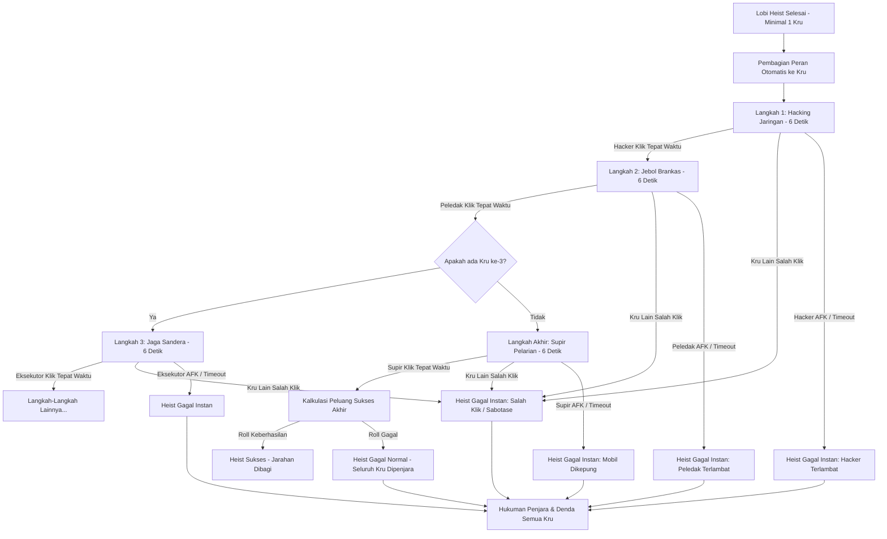

# Product Requirement Document (PRD) - Revamp Sistem Bank Heist Interaktif (Sequential Action Chain & Interference Instafail Edition)

## 1. Pendahuluan
Dokumen ini merinci pembaruan sistem perampokan bank (`.heist`) pada bot Discord Sentinel. Sistem diubah menjadi **sangat ekstrem (ultra hardcore)** dengan memperkenalkan mekanisme **Rantai Aksi Berurutan (Sequential Action Chain)** dan **Kegagalan Instan Akibat Gangguan/Salah Klik (Interference Instafail)**.

---

## 2. Deskripsi Masalah & Solusi
* **Masalah**: Pengguna menginginkan koordinasi tim yang sangat disiplin. Klik dari anggota yang salah saat bukan gilirannya tidak boleh hanya ditolak secara diam-diam, melainkan harus memicu kegagalan perampokan secara instan untuk melatih kedisiplinan tim.
* **Solusi**:
  1. **Rantai Aksi Berurutan (Turn-Based QTE)**: Eksekusi langkah-langkah heist berjalan satu per satu secara berurutan dalam batas waktu **6 detik per langkah**.
  2. **Hukuman Salah Klik (Interference Instafail)**: Jika ada anggota kru yang **bukan gilirannya** menekan tombol aksi aktif, sistem mendeteksi ini sebagai kepanikan/sabotase. Perampokan **langsung gagal seketika**, alarm berbunyi, dan seluruh kru dijebloskan ke penjara virtual + denda. Identitas pelaku salah klik akan diumumkan secara terbuka.
  3. **Kegagalan Waktu Habis (Timeout Fail)**: Jika kru yang ditargetkan tidak menekan tombol gilirannya dalam 6 detik, heist gagal otomatis.

---

## 3. Alur Kerja Sistem Aksi Berurutan & Instafail

### 3.1. Pembagian Peran Otomatis
Peran dibagi otomatis seperti sebelumnya:
1. `💻 Hacker` (Langkah 1)
2. `🧨 Ahli Peledak` (Langkah 2)
3. `🔫 Eksekutor` (Langkah 3 - jika ada 3+ kru)
4. `👜 Pembawa Jarahan` (Langkah 4 - jika ada 4+ kru)
5. `🚗 Supir Pelarian` (Langkah Akhir)

### 3.2. Penanganan Interaksi Tombol
Pada setiap tahapan aksi, bot menampilkan Embed Langkah dan Tombol Aksi spesifik.
* **Mekanisme Validasi Klik**:
  * Bot memvalidasi ID user yang mengklik tombol.
  * Jika `user.id === targetUserId`, bot memproses langkah sebagai **sukses** dan berlanjut ke langkah berikutnya.
  * Jika `user.id !== targetUserId` namun user tersebut **termasuk salah satu peserta Heist**:
    * Bot mendeteksi ini sebagai **salah giliran / salah klik**.
    * Operasi heist **langsung gagal instan (Interference Instafail)**!
    * Bot menyunting pesan dan mengumumkan:
      > ❌ **HEIST GAGAL TOTAL: SALAH KLIK / KEPANIKAN KRU!**
      > 
      > 🔴 **Penyebab**: Anggota kru <@user_id_salah> panik dan menekan tombol yang bukan perannya/gilirannya, memicu detektor laser alarm bank!
      > 👮 **Konsekuensi**: Alarm menyalak keras, pintu keluar otomatis terkunci besi baja. Seluruh kru tertangkap polisi!
    * Seluruh kru dijebloskan ke penjara virtual + denda koin.
  * Jika user yang mengklik **bukan peserta Heist**, bot mengabaikan klik tersebut atau membalas dengan pesan ephemeral: `❌ Anda tidak berpartisipasi dalam perampokan ini!`.

---

## 4. Rencana Verifikasi
1. **Uji Coba Salah Klik (Instafail)**:
   * Jalankan heist dengan minimal 2 akun.
   * Pada Langkah 1 (giliran Akun A), klik tombol menggunakan Akun B (peserta).
   * Pastikan bot langsung menghentikan heist, mempublikasikan pesan kegagalan karena salah klik dari Akun B, memotong saldo denda semua kru, dan menjebloskan semua kru ke penjara virtual.
2. **Uji Coba Timeout**: Memastikan jika tidak ditekan dalam 6 detik oleh siapapun, heist gagal karena timeout.
3. **Uji Coba Keberhasilan**: Memastikan jika semua menekan tombol pada gilirannya masing-masing, perampokan selesai dengan lancar.
