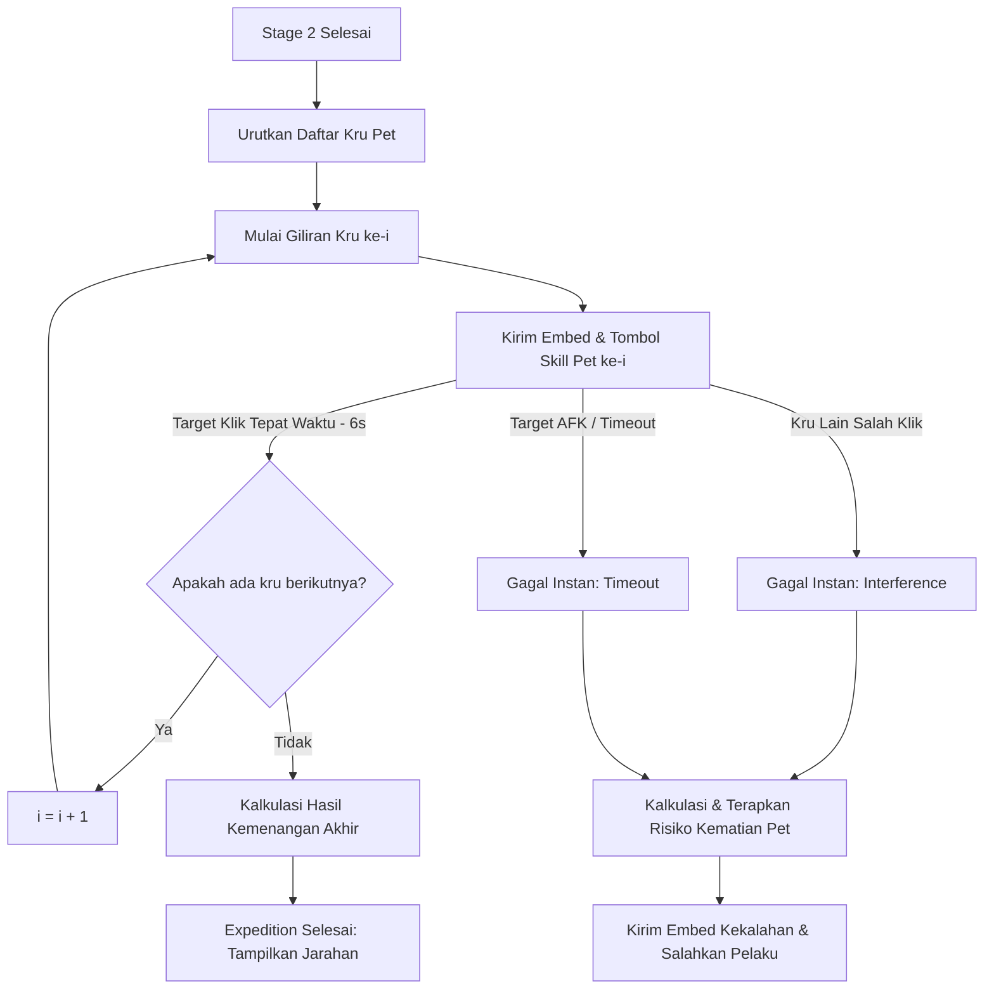

# Product Requirement Document (PRD) - Revamp Sistem Pet Ekspedisi (Interactive Co-op QTE, Blame, Death Risk & Dynamic Rewards Edition)

## 1. Pendahuluan
Fitur ekspedisi pet (`.pet expedition`) saat ini berjalan secara otomatis pada Stage 3 (Pertempuran Bos Akhir) berdasarkan simulasi teks acak. Untuk meningkatkan interaksi, ketegangan, dan kerja sama tim, Stage 3 akan dirombak menjadi **Sistem Pertempuran Giliran Aktif (Sequential QTE)** yang mirip dengan mekanisme Bank Heist. 

Pembaruan ini juga memperkenalkan **Risiko Kematian Pet Aktif** jika terjadi kegagalan QTE (berdasarkan level pet, tingkat kesulitan map, dan kecocokan level rekomendasi), serta **Skema Pembagian Hadiah Dinamis** (Solo mendapatkan penalti hasil, Co-op mendapatkan bonus hasil).

### Phase 3: Penyelarasan Mode Solo & Kematian
* Mengimplementasikan fitur pemilihan Multi-Pet milik pribadi untuk mode solo, serta sistem rekrutmen NPC Mercenary sebagai fallback.

---

## 2. Deskripsi Fitur & Mekanisme Game

* **Opsi A: Sistem Party Pet Pribadi (Solo Multi-Pet & Mercenary)**
  * Pemain solo dapat membawa hingga 2 pet cadangan miliknya sendiri dari kandang (stable) untuk ikut serta dalam ekspedisi (total 3 pet miliknya).
  * Jika pemain memiliki lebih dari satu pet hidup di akunnya, mereka dapat memilih pet cadangan tersebut untuk ikut bertarung.
  * **Fallback (Pet Mercenary NPC)**: Jika pemain tidak memiliki pet cadangan (hanya punya 1 pet), mereka dapat menyewa pet NPC bayaran (misal: 1 NPC healer / 1 NPC tank) dari barak petualang dengan biaya koin.
  * Selama pertempuran, **pemain solo akan mengendalikan tombol aksi untuk seluruh pet miliknya dan NPC tersebut** secara bergantian sesuai urutan giliran.
  * Hal ini mendorong pemain untuk aktif mengoleksi, merawat, dan melatih lebih dari 1 pet agar memiliki komposisi tim solo (Tank/DPS/Healer) yang tangguh tanpa bergantung pada NPC!

* **Sequential Turn-Based Skill (QTE)**: 
  * Di Stage 3, seluruh peserta ekspedisi akan mendapatkan giliran menyerang bos secara berurutan sesuai daftar indeks peserta (`0, 1, 2, ..., n-1`).
  * Pada setiap giliran, bot mengirimkan embed pertempuran dengan tombol **`⚡ Lepaskan Skill Pet`**.
  * Hanya pemilik pet yang sedang ditargetkan yang berhak menekan tombol tersebut dalam waktu **6 detik**.
* **Mekanisme Instafail & Blame (Penyebab Kegagalan)**:
  1. **Interference (Salah Klik)**: Jika ada peserta ekspedisi lain yang menekan tombol skill saat **bukan gilirannya**, ekspedisi **langsung gagal instan**. Pelaku salah klik diumumkan secara publik sebagai penyebab kegagalan tim.
  2. **Timeout (Waktu Habis)**: Jika target peran tidak menekan tombol dalam batas waktu **6 detik**, ekspedisi **gagal instan** karena keterlambatan reaksi. Anggota yang AFK tersebut diumumkan sebagai penyebab kekalahan.

* **Risiko Kematian Pet Saat Gagal QTE**:
  Jika ekspedisi gagal karena QTE (salah klik/timeout), pet peserta berisiko mati secara permanen (Status `DEAD`, HP `0`). Peluang kematian (`deathChance`) dihitung berdasarkan:
  * **Base Death Rate**: `2%`
  * **Faktor Level Pet**: Semakin tinggi level pet, semakin tinggi risiko kematian: `+(pet.level - 1) * 0.5%`.
  * **Faktor Zona Map**: Semakin tinggi ID peta, semakin tinggi bahaya rintangannya: `+mapId * 2%`.
  * **Penalti Level Tidak Sesuai**: Jika level pet lebih rendah dari rekomendasi map (`pet.level < recommendedLevel`), risiko mati meningkat drastis: `+(recommendedLevel - pet.level) * 6%`.
  * *Batas Maksimal Peluang Mati*: Dibatasi maksimal **85%** demi keadilan game.
  * *Penyelamatan*: Pet dengan item `LUCKY_AMULET` akan selamat (jimat hancur, HP disetel ke 20) dan pet dengan trait `SURVIVOR` akan selamat (HP disetel ke 1, status menjadi `WEAK`).
  * *Jika pet selamat (tidak mati)*: Pet hanya kehilangan **-25 HP** dan kebahagiaan/mood menurun drastis.

* **Skema Pendapatan Koin & XP (Solo vs Co-op)**:
  * **Mode Solo (Kru = 1)**:
    * Pendapatan Koin dipotong **70%** (hanya menerima `30%` dari hasil normal).
    * Pendapatan XP dipotong **70%** (hanya menerima `30%` dari hasil normal).
  * **Mode Bersama/Co-op (Kru > 1)**:
    * Pendapatan Koin dinaikkan **150%** (mendapatkan bonus `+50%` koin bersih per orang).
    * Pendapatan XP dinaikkan **150%** (mendapatkan bonus `+50%` XP bersih per orang).

---

## 3. Alur Kerja & Logika Sistem



### 3.1. Penanganan Klik & Validasi
* **Target Benar**: `user.id === targetUserId` -> Langkah sukses, lanjut ke giliran berikutnya setelah jeda 1 detik.
* **Interference (Salah Klik)**: `user.id !== targetUserId && participants.includes(user.id)` -> Ekspedisi langsung gagal instan. Panggil fungsi kegagalan QTE ekspedisi.
* **Non-Peserta**: `!participants.includes(user.id)` -> Abaikan klik dan kirim pesan ephemeral: `❌ Anda tidak berpartisipasi dalam ekspedisi ini!`.

---

## 4. Desain Visual Embeds

### 4.1. Embed Tahapan QTE Pet (`petExpeditionStepEmbed`)
* **Warna**: Kuning Aksi / Gold (`#FFB300`)
* **Deskripsi**:
  ```text
  👾 BOS ZONA: [Nama Bos]
  💥 GILIRAN AKSI: <@targetUserId> (Pet: [Nama Pet] Lv. [Lv] [Tipe])
  ⏳ WAKTU REAKSI: <t:TIMESTAMP:R> (6 Detik)
  
  Tembakan laser atau gada raksasa bos mengarah ke tim! Tekan tombol di bawah untuk melepaskan skill pertahanan/serangan naga/pheonix/turtle Anda!
  
  ⚠️ PERINGATAN: Hanya <@targetUserId> yang boleh menekan tombol! Salah klik dari kru lain akan menggagalkan seluruh ekspedisi!
  ```

### 4.2. Embed Kegagalan QTE Pet (`petExpeditionQteFailureEmbed`)
* **Warna**: Merah Pejuang / Dark Red (`#D32F2F`)
* **Deskripsi**:
  ```text
  💀 EKSPEDISI GAGAL: TIM TERPENTAL KELUAR! 💀
  
  💥 Lokasi Kegagalan: [Nama Zona]
  👥 Anggota Kru: <@kru1>, <@kru2>, ...
  
  [Penyebab Kegagalan]:
  - Timeout: 🔴 Kru <@failedUserId> lambat bereaksi, membuat pet miliknya terdiam mematung sehingga Bos menghempaskan seluruh tim!
  - Interference: 🚨 Kru <@failedUserId> panik dan menekan tombol skill di luar gilirannya! Gelombang energi pet yang bertabrakan menggagalkan formasi tim!
  
  🩹 STATUS KONSEKUENSI & KORBAN JIWA:
  - Pet A (<@kru1>): MENINGGAL DUNIA (Butuh Dokter) 🪦
  - Pet B (<@kru2>): Terluka parah (-25 HP) & Stress tinggi 🩹
  ```

---

## 5. Rencana Rincian Teknis Implementasi

1. **[pet.js](file:///Users/joefany/bot-discord-2026/stockmarket/pet.js)**:
   * Menambahkan fungsi `executeExpeditionQteFailure(guildId, participantIds, failedUserId, reasonType)`:
     * Mengambil status pet masing-masing peserta.
     * Mengkalkulasi peluang kematian pet berdasarkan level pet, ID map, dan selisih level rekomendasi.
     * Memperbarui status pet di database (mengubah status ke `DEAD` & health `0` jika mati; mengurangi `25` HP dan menaikkan stress `30` jika selamat).
     * Mengembalikan rekapitulasi status pet kru setelah kegagalan.
   * Memodifikasi `executeExpedition` untuk menerapkan pengali hasil:
     * Jika `kruCount === 1`: kalikan Koin dan XP didapat dengan `0.3` (potongan 70%).
     * Jika `kruCount > 1`: kalikan Koin dan XP didapat dengan `1.5` (bonus 50%).
2. **[embeds.js](file:///Users/joefany/bot-discord-2026/stockmarket/embeds.js)**:
   * Menambahkan `petExpeditionStepEmbed` dan `petExpeditionQteFailureEmbed(guild, zoneName, failedUserId, reasonType, participants, results)`.
3. **[index.js](file:///Users/joefany/bot-discord-2026/index.js)**:
   * Mengubah loop eksekusi Stage 3 pada lobi timeout menjadi loop sequential promise (menggunakan `createMessageComponentCollector` selama 6 detik per pemain).
   * Menghubungkan tombol QTE dengan validasi `targetUserId` dan pemicu kegagalan instan.
   * **Proteksi Saluran (Strict Channel Lock)**: Menghapus (delete) setiap pesan teks yang dikirim oleh member di saluran khusus ekspedisi pet saat status ekspedisi terdeteksi aktif, lalu mengirimkan pesan peringatan sementara (self-destructing warning) selama 3 detik.
