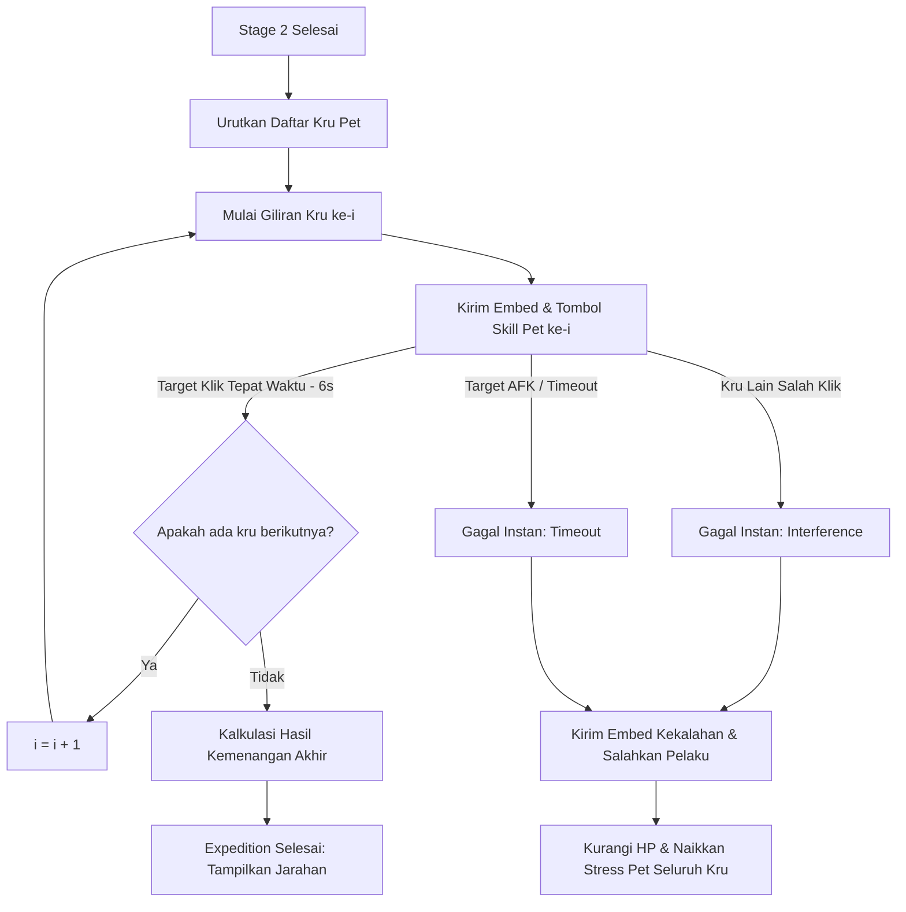

# Product Requirement Document (PRD) - Revamp Sistem Pet Ekspedisi (Interactive Co-op QTE & Blame System)

## 1. Pendahuluan
Fitur ekspedisi pet (`.pet expedition`) saat ini berjalan secara otomatis pada Stage 3 (Pertempuran Bos Akhir) berdasarkan simulasi teks acak. Untuk meningkatkan interaksi, ketegangan, dan kerja sama tim, Stage 3 akan dirombak menjadi **Sistem Pertempuran Giliran Aktif (Sequential QTE)** yang mirip dengan mekanisme Bank Heist. Setiap anggota tim wajib memicu skill peliharaannya secara bergantian dalam batas waktu reaksi yang ketat. Kelalaian atau kesalahan klik oleh salah satu anggota tim akan membuat ekspedisi gagal instan dan pelaku akan disalahkan secara terbuka.

---

## 2. Deskripsi Fitur & Mekanisme Game

* **Sequential Turn-Based Skill (QTE)**: 
  * Di Stage 3, seluruh peserta ekspedisi akan mendapatkan giliran menyerang bos satu per satu secara berurutan sesuai daftar indeks peserta (`0, 1, 2, ..., n-1`).
  * Pada setiap giliran, bot mengirimkan embed pertempuran dengan tombol **`⚡ Lepaskan Skill Pet`**.
  * Hanya pemilik pet yang sedang ditargetkan yang berhak menekan tombol tersebut dalam waktu **6 detik**.
* **Mekanisme Instafail & Blame (Penyebab Kegagalan)**:
  1. **Interference (Salah Klik)**: Jika ada peserta ekspedisi lain yang menekan tombol skill saat **bukan gilirannya**, ekspedisi **langsung gagal instan**. Pelaku salah klik diumumkan secara publik sebagai penyebab kegagalan tim.
  2. **Timeout (Waktu Habis)**: Jika target peran tidak menekan tombol dalam batas waktu **6 detik**, ekspedisi **gagal instan** karena keterlambatan reaksi. Anggota yang AFK tersebut diumumkan sebagai penyebab kekalahan.
* **Hasil Akhir (Success / Failure)**:
  * **Sukses QTE**: Jika seluruh anggota tim berhasil menekan tombol tepat waktu pada gilirannya masing-masing, tim lolos dari QTE dan bot melangsungkan kalkulasi peluang kemenangan akhir (`pet.executeExpedition`).
  * **Gagal QTE**: Seluruh pet dalam tim mengalami luka parah (**-25 HP**), stress bertambah (**+30 Stress**), dan koin hadiah didapat Rp 0.

---

## 3. Detail Alur Kerja Pertempuran QTE



### 3.1. Pembagian & Urutan Giliran
* Setiap pemilik pet yang terdaftar mendapatkan tepat satu kali giliran menyerang.
* Urutan giliran bersifat linier dari indeks `0` hingga `participants.length - 1`.

### 3.2. Penanganan Klik & Validasi
* **Target Benar**: `user.id === targetUserId` -> Langkah sukses, lanjut ke giliran berikutnya setelah jeda 1 detik.
* **Interference (Salah Klik)**: `user.id !== targetUserId && participants.includes(user.id)` -> Ekspedisi langsung gagal instan. Panggil fungsi kegagalan QTE ekspedisi.
* **Non-Peserta**: `!participants.includes(user.id)` -> Abaikan klik dan kirim pesan ephemeral: `❌ Anda tidak berpartisipasi dalam ekspedisi ini!`.

---

## 4. Desain Visual Embeds

### 4.1. Embed Tahapan QTE Pet (`petExpeditionStepEmbed`)
* **Warna**: Kuning Aksi / Gold (`#FFB300`)
* **Deskripsi**:
  ```text
  👾 BOS ZONA: [Nama Bos]
  💥 GILIRAN AKSI: <@targetUserId> (Pet: [Nama Pet] Lv. [Lv] [Tipe])
  ⏳ WAKTU REAKSI: <t:TIMESTAMP:R> (6 Detik)
  
  Tembakan laser atau gada raksasa bos mengarah ke tim! Tekan tombol di bawah untuk melepaskan skill pertahanan/serangan naga/pheonix/turtle Anda!
  
  ⚠️ PERINGATAN: Hanya <@targetUserId> yang boleh menekan tombol! Salah klik dari kru lain akan menggagalkan seluruh ekspedisi!
  ```

### 4.2. Embed Kegagalan QTE Pet (`petExpeditionQteFailureEmbed`)
* **Warna**: Merah Pejuang / Dark Red (`#D32F2F`)
* **Deskripsi**:
  ```text
  💀 EKSPEDISI GAGAL: TIM TERPENTAL KELUAR! 💀
  
  💥 Lokasi Kegagalan: [Nama Zona]
  👥 Anggota Kru: <@kru1>, <@kru2>, ...
  
  [Penyebab Kegagalan]:
  - Timeout: 🔴 Kru <@failedUserId> lambat bereaksi, membuat pet miliknya terdiam mematung sehingga Bos menghempaskan seluruh tim!
  - Interference: 🚨 Kru <@failedUserId> panik dan menekan tombol skill di luar gilirannya! Gelombang energi pet yang bertabrakan menggagalkan formasi tim!
  
  🩹 KONSEKUENSI:
  Seluruh pet kru terluka parah (-25 HP) dan mengalami stres tinggi (+30 Stress). Hadiah ekspedisi dibatalkan!
  ```

---

## 5. Rencana Rincian Teknis Implementasi

1. **[pet.js](file:///Users/joefany/bot-discord-2026/stockmarket/pet.js)**:
   * Menambahkan fungsi `executeExpeditionQteFailure(guildId, participantIds, failedUserId, reasonType)` untuk memproses pengurangan HP pet seluruh kru (max HP cap ke minimal 5 HP), menaikkan stress, dan mencatat transaksi gagal tanpa koin.
2. **[embeds.js](file:///Users/joefany/bot-discord-2026/stockmarket/embeds.js)**:
   * Menambahkan `petExpeditionStepEmbed` dan `petExpeditionQteFailureEmbed`.
3. **[index.js](file:///Users/joefany/bot-discord-2026/stockmarket/index.js)**:
   * Mengubah loop eksekusi Stage 3 pada lobi timeout menjadi loop sequential promise (menggunakan `createMessageComponentCollector` selama 6 detik per pemain).
   * Menghubungkan tombol QTE dengan validasi `targetUserId` dan pemicu kegagalan instan.
