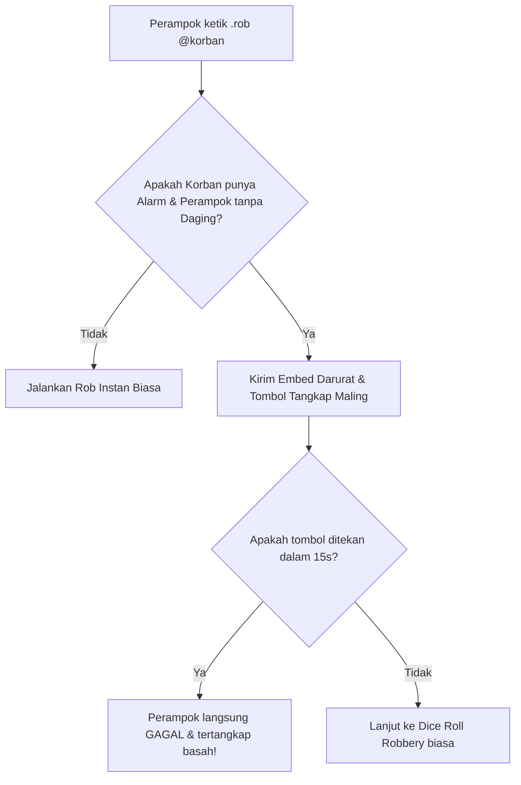
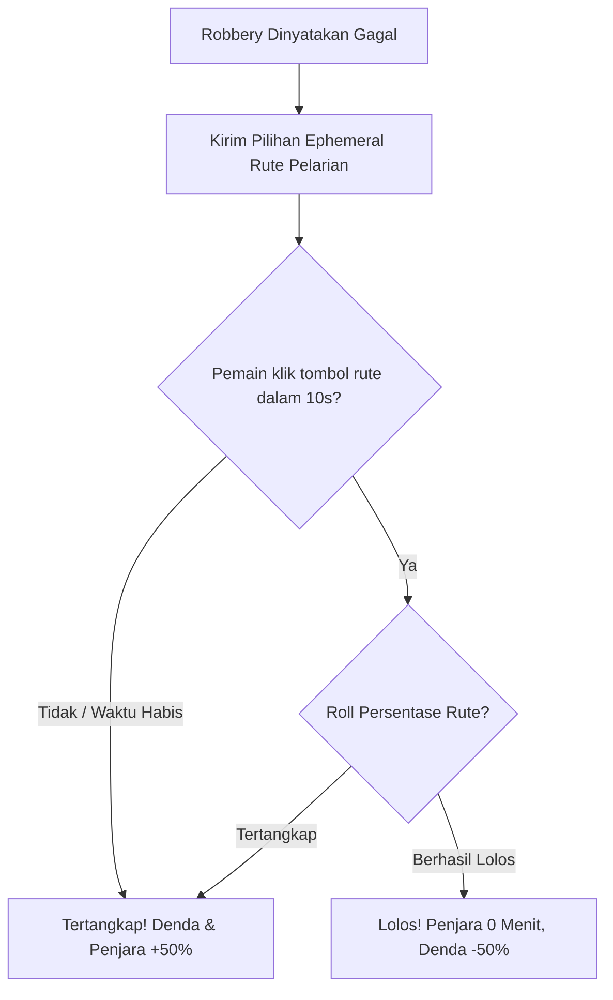

# Product Requirement Document (PRD)
## Fitur: Revamp Sistem Rob Interaktif (Begal, Teriak Maling & Bounty Hunting)

| Dokumen Info | Detail |
| --- | --- |
| **Status** | Draft / In Review |
| **Penulis** | Antigravity AI |
| **Tanggal Pembuatan** | 5 Juni 2026 |
| **Target Rilis** | Sprint 8 (Kriminalitas & Keadilan Server) |
| **Target Platform** | Discord Bot (Sentinel Bot) |

---

## 1. Latar Belakang & Tujuan
Sistem perampokan solo (`.rob`) saat ini bersifat instan dan hanya mengandalkan perhitungan persentase acak (dice roll) di balik layar. Hal ini membuat interaksi antar-pemain terasa pasif:
- Korban hanya menerima notifikasi kehilangan uang tanpa kesempatan membela diri.
- Pelaku perampokan yang gagal langsung dijebloskan ke penjara secara otomatis tanpa ada peluang untuk meloloskan diri.
- Status buronan (`wanted_until`) kurang memberikan dampak sosial yang dinamis di dalam server.

**Tujuan Dokumen Ini:**
- Membuat sistem `.rob` menjadi lebih interaktif, menegangkan, dan melibatkan respon cepat (Quick-Time Event / QTE) baik dari pelaku maupun korban.
- Memperkenalkan mekanisme pertahanan aktif bagi korban yang memasang Alarm di kamarnya melalui fitur **"Teriak Maling!"**.
- Memperkenalkan sistem kejar-kejaran polisi (**Police Chase QTE**) bagi pelaku yang gagal merampok.
- Mengaktifkan peran baru bagi warga sebagai **Bounty Hunter (Buru Sergap)** untuk menangkap pemain buronan lewat perintah `.arrest`.

---

## 2. Deskripsi Fitur Baru

### 2.1 Mekanisme "Teriak Maling!" (Active Victim Defense)
Jika korban memasang fasilitas **`ALARM`** di kosannya, dan pelaku **TIDAK** menggunakan item **`MEAT`** (Daging Bius) dari Black Market, maka sistem tidak langsung menghitung kesuksesan rob. Sebaliknya, sistem akan membunyikan alarm publik di channel obrolan:

- **Notifikasi Publik:** Bot mengirimkan pesan embed darurat:  
  `🚨 MALING TERDETEKSI! 🚨`  
  `<@robber> sedang mencoba merampok rumah <@victim>! Gembok dan Alarm berbunyi kencang!`
- **Tombol Respons Cepat (QTE):** Bot menyertakan tombol merah `👮 Tangkap Maling!` yang hanya bisa diklik oleh korban (atau warga lain yang sedang online jika ingin membantu).
- **Validasi Waktu (Waktu Respons: 15 detik):**
  - **Jika Korban/Warga menekan tombol < 15 detik:** Pelaku otomatis tertangkap basah! Pelaku langsung dijebloskan ke penjara dengan denda maksimal, dan korban menerima ganti rugi penuh.
  - **Jika tombol tidak ditekan > 15 detik:** Pelaku memiliki peluang lolos. Sistem akan melanjutkan ke perhitungan persentase sukses perampokan seperti biasa (dengan penalti alarm).

---

### 2.2 Pengejaran Polisi Interaktif (Police Chase QTE)
Jika perampokan gagal (baik karena dice roll gagal atau tertangkap alarm), perampok tidak langsung masuk penjara. Sistem akan memberikan kesempatan terakhir untuk melarikan diri:

- **Pemicu Chase:** Bot mengirimkan pesan interaktif pribadi (ephemeral) kepada perampok:  
  `🚨 POLISI MENGEPUNG ANDA! 🚨`  
  `Pilih rute pelarianmu sekarang secara cepat! (Waktu: 10 detik)`
- **Pilihan Tombol Acak (QTE):** Bot menyediakan 3 tombol aksi pelarian acak, contoh:
  - `🚗 Terobos Gang Sempit`
  - `🏃 Lari ke Keramaian Pasar`
  - `🌉 Lompat ke Jembatan Layang`
  *(Salah satu tombol adalah jalan pintas aman dengan peluang sukses 70%, satu tombol jebakan dengan peluang 20%, dan satu tombol normal 40%).*
- **Hasil Chase:**
  - **Jika Berhasil Melarikan Diri:** Perampok lolos dari penjara! Tidak ada waktu tahanan, dan denda dikurangi sebesar 50%.
  - **Jika Tertangkap Polisi / Waktu Habis:** Perampok tertangkap! Durasi penjara **ditambah +50%** dan denda **ditambah +50%** dari tarif normal karena mencoba melawan hukum.

---

### 2.3 Sistem Pemburu Buronan (Bounty Hunter & `.arrest`)
Pemain yang melakukan pencurian besar (berhasil merampok $\ge$ Rp 1.500) akan mendapatkan status Buronan (`wanted_until`) disertai dengan **Bounty (Hadiah Sayembara)** di kepalanya:

- **Kalkulasi Bounty:** Hadiah bounty bernilai **50% dari total uang yang berhasil dicuri** (ditanggung oleh Asuransi Bank Sentral).
- **Sayembara Aktif:** Buronan akan masuk ke dalam daftar buronan publik.
- **Aksi Penangkapan (`.arrest @user`):** 
  - Warga lain dapat mengetik `.arrest @user` untuk mencoba menangkap buronan tersebut.
  - Peluang menangkap buronan adalah **45%** base rate. 
  - Peluang tangkap dapat ditingkatkan jika pemburu memiliki item **`Borgol` (Handcuffs)** di inventory mereka (item baru di Toko Pet / Black Market seharga Rp 500, memberikan bonus +20% tangkap).
  - **Hasil Sukses:** Pemburu mendapatkan hadiah bounty tunai, buronan dijebloskan ke penjara selama 3 jam, dan status wanted buronan dihapus.
  - **Hasil Gagal:** Pemburu terkena serangan balik dari buronan dan kehilangan HP pet aktifnya sebesar 20 HP (atau denda Rp 200 kompensasi ke buronan).

---

## 3. Alur Interaksi Pengguna (User Flow)

### 3.1 Alur Perampokan dengan Alarm

### 3.2 Alur QTE Pengejaran Polisi (Chase QTE)

---

## 4. Rencana Teknis & Skema Database

### 4.1 Modifikasi Database (`wallets` & `user_inventory`)
- Tambahkan kolom `wanted_bounty` (`INTEGER DEFAULT 0`) pada tabel `wallets` untuk menyimpan nilai sayembara buronan saat ini.
- Daftarkan item baru `HANDCUFFS` (Borgol) pada database inventaris untuk pemburu buronan.

### 4.2 Pembaruan Kode Logika
1. **`stockmarket/robbery.js`**:
   - Modifikasi `robSolo` agar tidak langsung menjebloskan pelaku ke penjara saat gagal.
   - Buat fungsi penengah `triggerPoliceChase(userId, guildId, message)` untuk mengirim QTE pelarian dan memproses hasilnya.
   - Buat fungsi `arrestBuronan(hunterId, targetId, guildId)` untuk memproses perintah `.arrest` dan pembagian hadiah bounty.
2. **`stockmarket/index.js`**:
   - Tambahkan listener text command `.arrest` / `/arrest`.
   - Tambahkan button handler untuk tombol `👮 Tangkap Maling!` (Alarm) dan tombol QTE pelarian.

---

## 5. Pertanyaan Terbuka untuk User (Open Questions)

> [!IMPORTANT]
> 1. Apakah tombol "Tangkap Maling!" pada Alarm hanya boleh ditekan oleh korban perampokan saja, atau warga server lain juga boleh menekan tombol tersebut untuk membantu korban?
> 2. Apakah denda perampokan yang gagal saat melarikan diri (Chase QTE) dipotong dari dompet pelaku dan diberikan sebagai kompensasi ke korban seperti sistem lama, atau disita oleh polisi (dibakar/masuk kas bank)?
