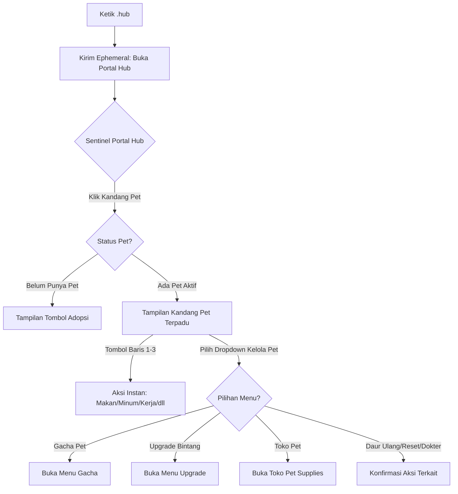

# Product Requirement Document (PRD)
## Fitur: Simplifikasi Portal Hub (`.hub`) & Pusat Pet Terpadu

| Dokumen Info | Detail |
| --- | --- |
| **Status** | Draft / In Review |
| **Penulis** | Antigravity AI |
| **Tanggal Pembuatan** | 5 Juni 2026 |
| **Target Rilis** | Sprint 7 (Optimalisasi UI/UX) |
| **Target Platform** | Discord Bot (Sentinel Bot) |

---

## 1. Latar Belakang & Tujuan
Saat ini, menu interaktif **Sentinel Portal Hub (`.hub`)** dan **Kandang Pet** memiliki jumlah tombol (button) yang terlalu banyak dan berserakan. 
- Di **Portal Hub Utama (`.hub`)**, terdapat 13 tombol yang memakan 3 baris Action Row, dengan baris ketiga yang tidak simetris (hanya 3 tombol). Selain itu, terdapat tombol-tombol pet yang tumpang tindih (seperti Gacha Pet dan Upgrade Bintang).
- Di **Kandang Pet**, terdapat hingga 14 tombol interaktif dan 1 dropdown menu. Jumlah komponen yang sangat banyak ini membuat tampilan sangat padat, membingungkan pemain, serta mendekati batas maksimal Action Row yang diizinkan oleh Discord (maksimal 5 baris).

**Tujuan Dokumen Ini:**
- Menyederhanakan dan merapikan struktur tombol pada Portal Hub Utama (`.hub`) agar lebih estetis, simetris, dan mudah dipahami.
- Menata ulang panel **Kandang Pet** dengan mengelompokkan tombol-tombol yang sejenis dan memindahkan aksi manajemen/lanjutan ke dalam satu menu dropdown **`⚙️ Kelola Pet`**.
- Meningkatkan kegunaan (usability) bagi pengguna mobile agar tidak terganggu oleh tumpukan tombol yang terlalu rapat.

---

## 2. Deskripsi Perubahan (Proposed Changes)

### 2.1 Restrukturisasi Portal Hub Utama (`.hub`)
Semua tombol terkait pet (kecuali gerbang utama Kandang Pet) akan dihapus dari Hub utama dan dipindahkan ke dalam sub-menu Kandang Pet. Dengan ini, layout utama menjadi sangat bersih dan simetris (2 baris x 5 tombol):

*   **Baris ke-1 (Finansial & Profil Warga):**
    1.  `🛍️ Toko Role` (eco_btn_open_shop_private_perm) - Style: Success
    2.  `📈 Bursa Saham` (eco_btn_open_market_private_perm) - Style: Primary
    3.  `🏦 Bank Sentral` (eco_btn_open_bank_private_perm) - Style: Secondary
    4.  `🕵️‍♂️ Black Market` (eco_btn_open_bm_private_perm) - Style: Danger
    5.  `🎒 Profil & Aset` (eco_btn_open_inventory_private_perm) - Style: Primary
*   **Baris ke-2 (Sosial & Gaya Hidup):**
    1.  `🐾 Kandang Pet` (pet_btn_open_pet_private_perm) - Style: Success
    2.  `🛌 Sewa Kosan` (eco_btn_open_kos_private_perm) - Style: Primary
    3.  `🌱 Cozy Garden` (eco_btn_open_garden_private_perm) - Style: Success
    4.  `📋 Misi Harian` (pet_btn_open_quests_private_perm) - Style: Primary
    5.  `🎟️ Lotre Mingguan` (eco_btn_lottery_hub) - Style: Success

*Dengan perubahan ini, tombol `🛒 Toko Pet`, `🎰 Gacha Pet`, dan `✨ Upgrade Bintang` resmi dilepas dari Portal Hub utama.*

---

### 2.2 Reorganisasi & Penyederhanaan Panel Kandang Pet
Di dalam panel Kandang Pet, kita akan mengonsolidasikan 14 tombol menjadi kombinasi tombol aksi harian dan satu menu dropdown khusus untuk manajemen lanjutan.

#### A. Layout Tombol & Menu Baru (Maksimal 4-5 Baris):
*   **Baris ke-1: Perawatan Pet (Care Actions)**
    - `🍗 Makan` (pet_btn_feed) - Melakukan konsumsi makanan dengan fitur auto-buy.
    - `🥤 Minum` (pet_btn_drink) - Melakukan konsumsi minuman dengan fitur auto-buy.
    - `⚽ Main` (pet_btn_play) - Memulihkan kebahagiaan pet.
    - `💊 Obat` (pet_btn_cure) - Menyembuhkan penyakit/HP pet dengan fitur auto-buy.
*   **Baris ke-2: Aktivitas & Utilitas Pet**
    - `💼 Kerja` (pet_btn_work) - Mengirim pet bekerja.
    - `🏹 Berburu` (pet_btn_hunt) - Mengirim pet berburu (hanya aktif jika dewasa/level $\ge$ 10).
    - `💍 Kawin Silang` (pet_btn_breed) - Membuka menu kawin silang (hanya aktif jika dewasa/level $\ge$ 10).
    - `🎒 Tas Pet` (pet_btn_use_booster) - Membuka tas inventaris item pet.
*   **Baris ke-3: Utilitas Sistem**
    - `🤖 Auto Care` (pet_btn_autocare) - Mengaktifkan/mengecek fitur auto care.
    - `🔄 Segarkan` (pet_btn_refresh) - Memperbarui status stats pet.
*   **Baris ke-4: Dropdown Menu Kelola Pet (`⚙️ Kelola Pet`)**
    Dropdown menu (`pet_select_manage_actions`) berisi pilihan aksi administrasi & manajemen pet berikut:
    1.  `🎰 Gacha Pet` - Membuka menu spin/gacha pet.
    2.  `✨ Upgrade Bintang` - Membuka menu upgrade bintang pet.
    3.  `🛒 Toko Pet` - Membuka menu toko perlengkapan pet.
    4.  `♻️ Daur Ulang Pet` - Melakukan daur ulang pet aktif untuk mendapatkan koin/item.
    5.  `🧹 Reset Kandang` - Mengosongkan kandang / menghapus pet aktif.
    6.  `🛎️ Adopsi Telur Pet` - Membuka menu adopsi telur pet (khusus jika slot pet masih tersedia).
    7.  `🏥 Dokter Pet` - Memanggil dokter untuk menghidupkan kembali pet yang mati (hanya muncul/bisa dipilih jika pet berstatus `DEAD`).
*   **Baris ke-5: Dropdown Pilihan Pet Aktif (Kondisional)**
    - Menu dropdown `pet_select_active` untuk mengganti peliharaan aktif (hanya ditampilkan jika pemain memiliki lebih dari 1 pet).

---

## 3. Alur Interaksi Pengguna (User Flow)

### 3.1 Alur Navigasi Utama

---

## 4. Rencana Spesifikasi Teknis & Modifikasi Kode

1.  **`stockmarket/index.js`**:
    *   Perbarui fungsi `getPortalHubData(client)` untuk hanya mengembalikan 2 baris komponen (total 10 tombol).
    *   Perbarui handler tombol `pet_btn_open_pet_private_perm` untuk membangun layout tombol Kandang Pet yang baru (Baris 1-3 berisi tombol, Baris 4 berisi dropdown `⚙️ Kelola Pet`, Baris 5 berisi dropdown ganti pet aktif jika dimiliki > 1).
    *   Tambahkan penanganan event dropdown menu baru (`pet_select_manage_actions`). Ketika opsi dipilih, panggil fungsi sub-dashboard yang sesuai (seperti membuka Gacha, membuka Toko, atau memicu modal/konfirmasi upgrade/daur ulang/reset).
    *   Pastikan alur penutupan/penonaktifan tombol ketika collector habis (`collector.on('end')`) juga menonaktifkan dropdown `⚙️ Kelola Pet`.

2.  **`stockmarket/pet.js`**:
    *   Verifikasi kesiapan fungsi-fungsi pendukung seperti `adoptPet`, `resetPet`, `buyItem`, `useItem`, dan daur ulang agar siap diintegrasikan melalui trigger dropdown baru.

3.  **`stockmarket/embeds.js`**:
    *   Pastikan visualisasi dari embed yang dikirimkan tetap rapi dan selaras dengan perubahan tata letak tombol yang baru.

---

## 5. Pertanyaan Terbuka untuk User (Open Questions)

> [!IMPORTANT]
> 1. Apakah ada fungsionalitas tombol lama yang ingin diubah perilakunya saat dipindahkan ke dropdown (misalnya tombol Gacha Pet atau Upgrade Bintang)?
> 2. Apakah susunan 10 tombol di Portal Hub utama sudah sesuai dengan preferensi Anda, atau ada tombol lain yang ingin digeser/ditambahkan?
